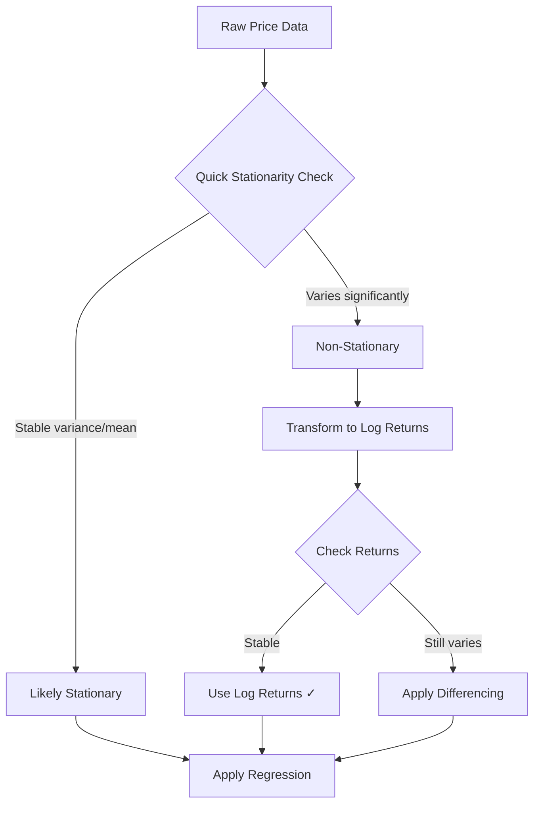

# Stationarity Testing & Data Transformation

> **Related**: [TrendsMicroService_MathematicalTheory.md](./TrendsMicroService_MathematicalTheory.md)  
> **Status**: VALIDATED  
> **Criticality**: CRITICAL

---

## Overview

Financial price data is **non-stationary** by nature - its mean and variance change over time. Applying standard regression techniques to non-stationary data produces **spurious results** with misleading R² values and invalid confidence intervals.

---

## What is Stationarity?

A time series is **stationary** if its statistical properties (mean, variance, autocorrelation) do not change over time.

| Type | Description |
|------|-------------|
| **Weak Stationarity** | Constant mean and variance, covariance depends only on lag |
| **Strict Stationarity** | Full probability distribution is time-invariant |

### Why It Matters for Trading

| Issue | Impact |
|-------|--------|
| **Spurious Regression** | High R² values that are statistically meaningless |
| **Invalid Coefficients** | Slope and intercept have no predictive value |
| **Misleading Confidence** | Cannot trust prediction intervals |

---

## Augmented Dickey-Fuller (ADF) Test

The ADF test determines if a time series has a **unit root** (is non-stationary).

### Hypotheses

- **H₀ (Null)**: Series has unit root → **NON-STATIONARY**
- **H₁ (Alternative)**: Series has no unit root → **STATIONARY**

### Interpretation

| Condition | Conclusion |
|-----------|------------|
| p-value < 0.05 | Reject H₀ → Series is **STATIONARY** |
| p-value ≥ 0.05 | Fail to reject H₀ → Series is **NON-STATIONARY** |

### Critical Values (Standard)

| Significance | Critical Value |
|--------------|----------------|
| 1% | -3.43 |
| 5% | -2.86 |
| 10% | -2.57 |

> **Note**: More negative test statistics = stronger evidence of stationarity

---

## Data Transformations

### Log Returns (Preferred)

Transform prices to log returns for stationarity:

```
r(t) = ln(P(t) / P(t-1))
```

**Advantages:**
- Often stationary even when prices are not
- Symmetric: +10% and -10% are equal magnitudes
- Additive: r₁ + r₂ = r(cumulative)

### First-Order Differencing

```
ΔP(t) = P(t) - P(t-1)
```

Use when log returns are still non-stationary (rare).

---

## Implementation

```typescript
interface StationarityTestResult {
    isStationary: boolean;
    adfStatistic: number;
    pValue: number;
    criticalValues: {
        '1%': number;
        '5%': number;
        '10%': number;
    };
    recommendation: 'USE_PRICES' | 'USE_RETURNS' | 'USE_DIFFERENCING';
}

class StationarityHelper {
    /**
     * Transform prices to log returns
     * r(t) = ln(P(t) / P(t-1))
     */
    toLogReturns(prices: number[]): number[] {
        return prices.slice(1).map((p, i) => 
            Math.log(p / prices[i])
        );
    }
    
    /**
     * First-order differencing
     * ΔP(t) = P(t) - P(t-1)
     */
    difference(data: number[], order: number = 1): number[] {
        let result = [...data];
        for (let d = 0; d < order; d++) {
            result = result.slice(1).map((v, i) => v - result[i]);
        }
        return result;
    }
    
    /**
     * Simplified stationarity check using variance ratio
     * (Full ADF requires statistical library)
     */
    quickStationarityCheck(data: number[]): boolean {
        const n = data.length;
        const half = Math.floor(n / 2);
        
        const firstHalf = data.slice(0, half);
        const secondHalf = data.slice(half);
        
        const var1 = this.variance(firstHalf);
        const var2 = this.variance(secondHalf);
        const mean1 = this.mean(firstHalf);
        const mean2 = this.mean(secondHalf);
        
        // Check if variance and mean are relatively stable
        const varRatio = var1 / var2;
        const meanDiff = Math.abs(mean1 - mean2) / Math.max(Math.abs(mean1), Math.abs(mean2));
        
        return varRatio > 0.5 && varRatio < 2.0 && meanDiff < 0.1;
    }
}
```

---

## Decision Flow



---

## Validation Sources

- Wikipedia: Augmented Dickey-Fuller test
- TowardsDataScience: Time Series Stationarity
- QuantInsti: Unit Root Testing
- Investopedia: Non-Stationary Data

---

## Key Takeaway

> **NEVER apply linear regression directly to price data. Always transform to log returns first.**
