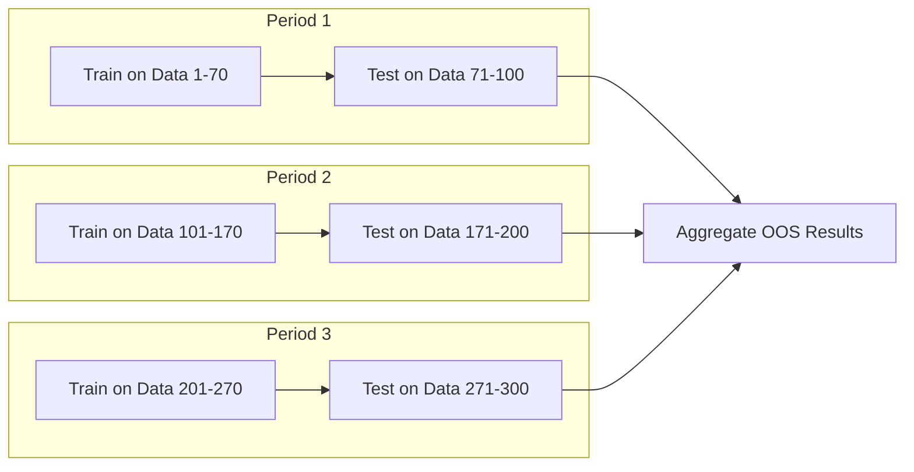

# Walk-Forward Analysis & Backtesting

> **Related**: [TrendsMicroService_MathematicalTheory.md](../TrendsMicroService_MathematicalTheory.md)  
> **Status**: VALIDATED  
> **Criticality**: CRITICAL

---

## Overview

**Walk-Forward Analysis (WFA)** is the gold standard for validating trading strategies. Unlike simple backtesting, it simulates real-world conditions by testing on data the model has never seen.

---

## The Problem with Traditional Backtesting

| Issue | Impact |
|-------|--------|
| **Overfitting** | Strategy works on historical data but fails live |
| **Look-Ahead Bias** | Using future information to make past decisions |
| **Selection Bias** | Choosing the best of many tested strategies by chance |
| **Data Snooping** | Repeatedly testing until finding "good" results |

---

## Walk-Forward Analysis Process



### Steps

1. **Divide data** into multiple periods
2. **Train (In-Sample)**: Optimize parameters on ~70% of each period
3. **Test (Out-of-Sample)**: Evaluate on remaining ~30% (never seen)
4. **Roll forward**: Move to next period and repeat
5. **Aggregate**: Combine all out-of-sample results for final metrics

---

## Types of Walk-Forward

| Type | Description | Best For |
|------|-------------|----------|
| **Rolling** | Fixed-size window moves forward | Intraday, adapting to recent conditions |
| **Anchored** | Window grows from fixed start | Longer timeframes, accumulating history |

---

## Implementation

```typescript
interface WalkForwardConfig {
    insampleRatio: number;      // 0.7 = 70% train, 30% test
    periods: number;            // Number of walk-forward periods
    commission: number;         // Transaction cost per trade
    slippage: number;           // Expected slippage
}

interface PeriodResult {
    period: number;
    insampleMetrics: TradingMetrics;
    outsampleMetrics: TradingMetrics;
    optimizedParams: StrategyParams;
}

interface WalkForwardResult {
    periodResults: PeriodResult[];
    aggregatedMetrics: TradingMetrics;
    robustnessScore: number;    // How consistent across periods
    overfitRisk: string;        // LOW, MEDIUM, HIGH
}

class BacktestEngine {
    /**
     * Walk-Forward Analysis - Gold Standard
     */
    async runWalkForward(
        data: HistoricalPrice[],
        strategy: Strategy,
        config: WalkForwardConfig
    ): Promise<WalkForwardResult> {
        const periodLength = Math.floor(data.length / config.periods);
        const insampleLength = Math.floor(periodLength * config.insampleRatio);
        const outsampleLength = periodLength - insampleLength;
        
        const periodResults: PeriodResult[] = [];
        
        for (let p = 0; p < config.periods; p++) {
            const start = p * periodLength;
            const insampleEnd = start + insampleLength;
            const outsampleEnd = insampleEnd + outsampleLength;
            
            // 1. Optimize on in-sample (training data)
            const trainData = data.slice(start, insampleEnd);
            const optParams = await this.optimize(strategy, trainData);
            const insampleMetrics = this.evaluate(strategy, optParams, trainData);
            
            // 2. Test on out-of-sample (NEVER SEEN before!)
            const testData = data.slice(insampleEnd, outsampleEnd);
            const outsampleMetrics = this.evaluate(strategy, optParams, testData);
            
            periodResults.push({
                period: p,
                insampleMetrics,
                outsampleMetrics,
                optimizedParams: optParams
            });
        }
        
        // 3. Aggregate and assess robustness
        return this.aggregateResults(periodResults);
    }
    
    /**
     * Calculate robustness: how consistent is performance across periods?
     */
    private calculateRobustness(periodResults: PeriodResult[]): {
        score: number;
        overfitRisk: string;
    } {
        const outsampleReturns = periodResults.map(p => p.outsampleMetrics.totalReturn);
        const insampleReturns = periodResults.map(p => p.insampleMetrics.totalReturn);
        
        // Check if out-of-sample performance is significantly worse
        const avgInsample = insampleReturns.reduce((a, b) => a + b, 0) / insampleReturns.length;
        const avgOutsample = outsampleReturns.reduce((a, b) => a + b, 0) / outsampleReturns.length;
        
        const degradation = (avgInsample - avgOutsample) / Math.abs(avgInsample);
        
        // Calculate consistency (low std dev = consistent)
        const stdDev = this.calculateStdDev(outsampleReturns);
        const mean = avgOutsample;
        const coeffOfVariation = Math.abs(stdDev / mean);
        
        let overfitRisk = 'LOW';
        if (degradation > 0.5) overfitRisk = 'HIGH';
        else if (degradation > 0.25) overfitRisk = 'MEDIUM';
        
        const score = Math.max(0, 1 - degradation) * Math.max(0, 1 - coeffOfVariation);
        
        return { score, overfitRisk };
    }
}
```

---

## Monte Carlo Simulation

Complement walk-forward with Monte Carlo to test robustness:

```typescript
class MonteCarloSimulator {
    /**
     * Shuffle trade order to test if sequence matters
     */
    runSimulation(
        trades: Trade[],
        iterations: number = 1000
    ): MonteCarloResult {
        const finalReturns: number[] = [];
        
        for (let i = 0; i < iterations; i++) {
            // Randomly shuffle trade order
            const shuffled = this.shuffle([...trades]);
            const equity = this.calculateEquityCurve(shuffled);
            finalReturns.push(equity[equity.length - 1]);
        }
        
        return {
            mean: this.mean(finalReturns),
            median: this.percentile(finalReturns, 0.5),
            stdDev: this.stdDev(finalReturns),
            percentile5: this.percentile(finalReturns, 0.05),
            percentile95: this.percentile(finalReturns, 0.95),
            probabilityOfLoss: finalReturns.filter(r => r < 0).length / iterations
        };
    }
}
```

---

## Key Metrics to Track

| Metric | Purpose | Good Value |
|--------|---------|------------|
| **Out-of-Sample Return** | True performance | Positive |
| **In-Sample vs Out-of-Sample Gap** | Overfitting indicator | < 25% |
| **Sharpe Ratio** | Risk-adjusted return | > 1.0 |
| **Max Drawdown** | Worst-case loss | < 20% |
| **Win Rate** | % profitable trades | > 50% |
| **Profit Factor** | Gross profit / Gross loss | > 1.5 |

---

## Validation Sources

- Wikipedia: Walk-Forward Optimization
- QuantStart: Walk-Forward Analysis
- Interactive Brokers: Strategy Validation
- Unger Academy: Walk-Forward Testing
- AlgoTrading101: Backtesting Best Practices

---

## Key Takeaway

> **Always use Walk-Forward Analysis. Simple backtesting leads to overfitting and false confidence.**
