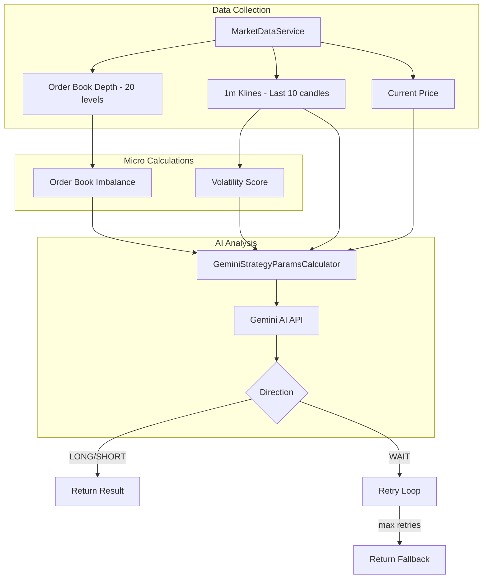

# AI Trend Analysis System Documentation

## Overview

The AI Trend Analysis system determines market direction (LONG/SHORT/WAIT) using a combination of:
1. **Real-time Order Book Analysis** - Bid/Ask volume imbalance
2. **Volatility Measurement** - Wick intensity from 1-minute candles
3. **Gemini AI Analysis** - Pattern recognition and parameter optimization

---

## Architecture



---

## Components

### 1. MarketMicroDataCalculator

**Purpose**: Collects and calculates micro-market indicators for AI analysis.

**Data Collected**:
| Data | Source | Description |
|------|--------|-------------|
| `lastPrice` | WebSocket stream | Mid-price from best bid/ask |
| `klines` | REST API | Last 10 one-minute candles |
| `depth` | REST API | Top 20 order book levels |

**Calculations**:

#### Order Book Imbalance

```typescript
imbalance = (bidVolume - askVolume) / (bidVolume + askVolume)
```

- **Range**: -1.0 to +1.0
- **Interpretation**:
  - `+1.0` = All bids, extreme buy pressure
  - `0.0` = Balanced order book
  - `-1.0` = All asks, extreme sell pressure

#### Volatility Score

```typescript
for each kline:
    upperWick = high - max(open, close)
    lowerWick = min(open, close) - low
    wickScore = (upperWick + lowerWick) / open * 10000

volatilityScore = average(wickScores)
```

- **Purpose**: Measures "wick intensity" - high values indicate price rejection
- **Threshold**: Score < 5 typically means choppy/sideways market

---

### 2. GeminiStrategyParamsCalculator

**Purpose**: Sends market data to Gemini AI and parses strategy parameters.

**Prompt Structure**:
```
You are a High-Frequency Trading Quant Engine.
Analyze this 1-minute market data for {symbol} and provide execution parameters.

Data:
- Price: {lastPrice}
- Order Book Imbalance: {imbalance} (-1 sell pressure, +1 buy pressure)
- Volatility Score: {volatilityScore} (Wick intensity)
- Last 5 Candles (Open, High, Low, Close, Vol): [...]

Task:
Determine immediate trend direction (1-5 min horizon).
Calculate 'sigma' (inversion threshold) based on volatility.
Calculate 'takeProfitPnlClick' (step size) based on candle body size.
```

**Response Format**:
```json
{
    "tendance": "LONG" | "SHORT" | "WAIT",
    "sigma": 2.5,
    "takeProfitPnlClick": 1.2,
    "reasoning": "Brief technical explanation",
    "confidence": 0.85
}
```

**Decision Rules** (encoded in prompt):
- If Imbalance opposes recent price move → WAIT (potential reversal)
- If Volatility Score < 5 → WAIT (chop)
- Sigma should be ~1.2x to 2.0x ATR

---

### 3. GeminiTrendAnalyzerService

**Purpose**: Orchestrates the analysis loop with retry mechanism.

**Algorithm**:

```
function runUntilSignal(symbol, maxRetries):
    retryDelay = settings.ai_trend_retry_delay_ms (default: 2000)
    
    for attempt = 1 to maxRetries:
        // 1. Collect micro-data
        microData = MarketMicroDataCalculator.fetchMicroData(symbol)
        if (!microData) continue
        
        // 2. Send to AI
        analysis = GeminiStrategyParamsCalculator.analyze(microData)
        
        // 3. Check result
        if (analysis.tendance == "LONG" or "SHORT"):
            return analysis  // Success!
        
        // 4. WAIT - retry after delay
        sleep(retryDelay)
    
    // 5. Max retries exhausted
    return { tendance: "WAIT", sigma: 2.0, confidence: 0 }
```

---

## Configuration Settings

| Setting | Default | Description |
|---------|---------|-------------|
| `gemini_api_key` | (required) | Gemini API authentication |
| `gemini_model` | `gemini-1.5-flash` | Model to use |
| `ai_trend_retry_delay_ms` | 2000 | Delay between retries on WAIT |
| `ai_trend_retry_interval_ms` | 2000 | Alias for retry delay |
| `trend_confirmation_max_wait_ms` | 15000 | Total timeout for loop |

---

## Integration Points

### 1. Initial Order (side='TRENDS')

```typescript
// ClickStrategyCore.ts L335-444
if (config.side === 'TRENDS') {
    const geminiService = GeminiTrendAnalyzerService.getInstance();
    const result = await geminiService.runUntilSignal(symbol, maxRetries);
    effectiveSide = result.tendance === 'LONG' ? 'BUY' : 'SELL';
    
    // Apply AI params
    config.sigma = result.sigma;
    config.takeProfitPnlClick = result.takeProfitPnlClick;
}
```

### 2. Post-Inversion (waitForTrendConfirmation)

```typescript
// ClickStrategyOrderManager.ts L650-720
private async waitForTrendConfirmation() {
    const geminiService = GeminiTrendAnalyzerService.getInstance();
    const result = await geminiService.runUntilSignal(symbol, maxRetries);
    return { direction: result.tendance, aiParams: {...} };
}
```

### 3. API Endpoint

```typescript
// StrategyController.ts L343-513
POST /api/strategy/:instanceKey/trend-analysis
// Returns: { direction, compositeScore, emaFast, emaSlow, rSquared, aiParams }
```

---

## UI Display (TrendAnalysisModal)

| Field | Source | Display |
|-------|--------|---------|
| Progress | `bufferStatus.current/max` | Progress bar with seconds |
| Direction | `direction` | LONG(green) / SHORT(red) / WAIT(yellow) |
| Score | `compositeScore` | Numeric with color |
| R² | `rSquared` | 3 decimal places |
| EMA Fast | `emaFast` | Reference line on chart (cyan) |
| EMA Slow | `emaSlow` | Reference line on chart (amber) |
| AI Sigma | `aiParams.sigma` | USDT value |
| AI TakeProfit | `aiParams.takeProfitPnlClick` | USDT value |
| AI Confidence | `aiParams.confidence` | Percentage badge |
| AI Reasoning | `aiParams.reasoning` | Italic text |

---

## Error Handling

| Scenario | Handling |
|----------|----------|
| No API key | Falls back to local TrendCalculatorService |
| AI timeout | Returns after maxRetries with WAIT |
| Parse error | Logs error, returns null |
| Network error | Continues to next retry |
