# Mathematical Theory - Document Index

> **Parent Document**: [TrendsMicroService_Analysis.md](./TrendsMicroService_Analysis.md)  
> **Status**: REVIEWED  
> **Created**: 2025-12-26

---

## Overview

This index provides access to focused mathematical theory documents for the Trend Analysis Microservice. Each document covers a specific topic with implementation code and validation sources.

---

## Research Validation Summary

Improvements are based on expert feedback ([TrendsMicroService_Analysis_FeedBack.md](./TrendsMicroService_Analysis_FeedBack.md)), validated against academic and industry sources.

### Implementation Priority

| Priority | Topic | Status |
|----------|-------|--------|
| 🔴 CRITICAL | Stationarity & ADF Testing | Validated |
| 🔴 CRITICAL | Autocorrelation Testing | Validated |
| 🔴 CRITICAL | Walk-Forward Backtesting | Validated |
| 🟠 HIGH | Hurst Exponent | Validated |
| 🟠 HIGH | Comprehensive Metrics | Validated |
| 🟡 OPTIONAL | GARCH Volatility | Validated |
| 🟡 OPTIONAL | Regime Detection | Validated |

---

## Document Index

### Critical Documents (Must Implement)

| Document | Description | Key Takeaway |
|----------|-------------|--------------|
| [📊 Stationarity & ADF Testing](./Math/Stationarity_ADF_Testing.md) | Non-stationarity, ADF test, log-returns transformation | **Never apply regression directly to prices** |
| [🔗 Autocorrelation Testing](./Math/Autocorrelation_Testing.md) | Durbin-Watson test, Ljung-Box, R² adjustment | **If DW ≠ 2, your R² is inflated** |
| [📈 Walk-Forward Backtesting](./Math/WalkForward_Backtesting.md) | Walk-forward analysis, Monte Carlo | **Gold standard for validation** |

### High Priority Documents

| Document | Description | Key Takeaway |
|----------|-------------|--------------|
| [📉 Hurst Exponent](./Math/Hurst_Exponent.md) | Mean-reversion vs trending detection | **H < 0.5 = oscillating, H > 0.5 = trending** |
| [📋 Comprehensive Metrics](./Math/Comprehensive_Metrics.md) | Sharpe, Sortino, Max Drawdown, Profit Factor | **Never evaluate on accuracy alone** |

### Optional Documents

| Document | Description | Key Takeaway |
|----------|-------------|--------------|
| [📊 GARCH Volatility](./Math/GARCH_Volatility.md) | Volatility clustering, dynamic thresholds | **Use for crypto volatility regime** |
| [🔄 Regime Detection](./Math/Regime_Detection.md) | Multi-factor regime detection, HMM | **Adapt strategy to market regime** |

---

## Quick Reference

### Data Transformation Flow

```mermaid
flowchart LR
    A[Raw Prices] --> B{ADF Test}
    B -->|Non-Stationary| C[Log Returns]
    B -->|Stationary| D[Use Prices]
    C --> E[Regression]
    D --> E
    E --> F{Durbin-Watson}
    F -->|DW ≠ 2| G[Adjust R²]
    F -->|DW ≈ 2| H[Valid R²]
```

### Key Formulas

| Formula | Purpose |
|---------|---------|
| `r(t) = ln(P(t) / P(t-1))` | Log returns |
| `DW = Σ(e(t)-e(t-1))² / Σe(t)²` | Durbin-Watson |
| `Sharpe = (R - Rf) / σ × √252` | Risk-adjusted return |
| `H = slope of log(R/S) vs log(lag)` | Hurst exponent |

### Interpretation Guide

| Indicator | Value | Meaning |
|-----------|-------|---------|
| **ADF p-value** | < 0.05 | Stationary ✓ |
| **Durbin-Watson** | ≈ 2.0 | No autocorrelation ✓ |
| **Hurst Exponent** | < 0.5 | Mean-reverting (oscillating) |
| **Hurst Exponent** | > 0.5 | Trending (persistent) |
| **Sharpe Ratio** | > 1.0 | Good risk-adjusted return |
| **Max Drawdown** | < 20% | Acceptable risk |

---

## Implementation Phases

### Phase 1 - Critical Corrections (Week 1-2)
- [ ] Implement log-returns transformation
- [ ] Add Durbin-Watson test
- [ ] Adjust R² for autocorrelation
- [ ] Add simplified stationarity check

### Phase 2 - Metrics & Validation (Week 3-4)
- [ ] Implement Sharpe/Sortino/MaxDrawdown
- [ ] Build walk-forward analysis framework
- [ ] Add comprehensive metrics dashboard

### Phase 3 - Advanced Models (Week 5-6)
- [ ] Implement Hurst exponent calculation
- [ ] Add multi-factor regime detection
- [ ] Optional: GARCH volatility modeling

---

## References

### Academic Sources
- López de Prado, M. (2018). "Advances in Financial Machine Learning"
- Aronson, D. (2006). "Evidence-Based Technical Analysis"
- Chan, E. (2008). "Quantitative Trading"

### Research Papers
- Bailey & López de Prado (2014). "The Deflated Sharpe Ratio"
- Bailey et al. (2015). "The Probability of Backtest Overfitting"

---

## Document Control

| Version | Date | Author | Changes |
|---------|------|--------|---------|
| 1.0 | 2025-12-26 | Architecture Team | Initial index with 7 sub-documents |
