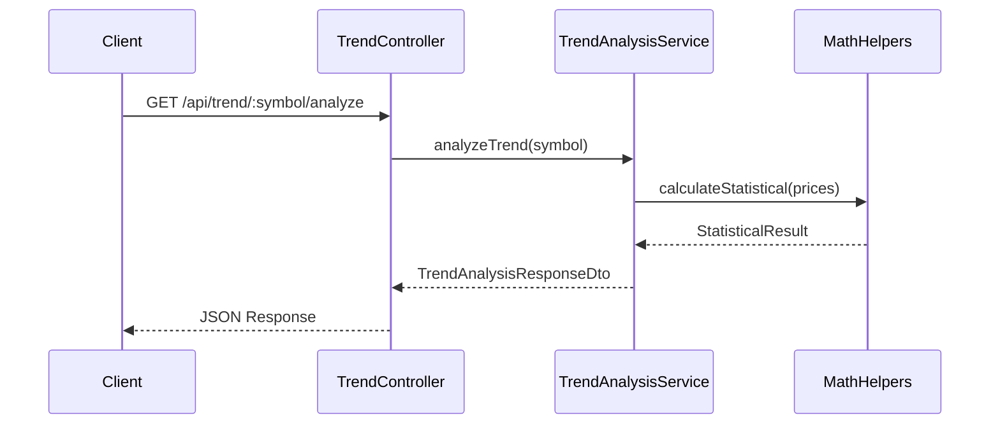

# Ark.Alliance.TrendsCalculator.Backend

> **Trend Analysis Microservice - Backend API and Mathematical Calculation Engine**

---

## Description

Node.js/Express backend service providing:
- **REST API** for trend analysis and configuration
- **WebSocket** for real-time price data streaming
- **Mathematical Engine** with statistical and AI-based calculations
- **Training Mode** for forecast evaluation

## Project Structure

```
src/
├── api/
│   ├── controllers/       # HTTP endpoints
│   ├── middleware/         # Error handling, logging, rate limiting
│   ├── routes/             # Express route registration
│   └── validators/         # Input validation (Zod)
├── services/               # Business logic
├── domain/
│   ├── entities/           # Core business objects
│   └── interfaces/         # Contracts for DI
├── infrastructure/
│   ├── clients/            # External services (Binance, AI)
│   ├── providers/          # AI provider implementations
│   └── repositories/       # Data persistence
├── helpers/
│   ├── statistics/         # LinearRegression, Stationarity, Autocorrelation
│   ├── indicators/         # EMA, SMA, VWAP, Hurst
│   ├── volatility/         # ATR, GARCH
│   ├── orderbook/          # Imbalance
│   ├── advanced/           # Backtest, Monte Carlo, Regime
│   └── MathHelperFactory.ts
├── config/                 # Configuration files
└── index.ts                # Entry point
```

## API Endpoints

| Controller | Base Path | Purpose |
|------------|-----------|---------|
| TrendController | `/api/trend` | Trend analysis |
| SymbolController | `/api/symbol` | Symbol tracking |
| ConfigController | `/api/config` | Configuration |
| TrainingController | `/api/training` | Training sessions |
| AITelemetryController | `/api/ai` | AI settings, telemetry, forecast |
| HealthController | `/health` | Health checks |

### AI Telemetry Endpoints

| Method | Endpoint | Description |
|--------|----------|-------------|
| GET | `/api/ai/settings` | Get AI provider configuration |
| PUT | `/api/ai/settings` | Update AI configuration |
| POST | `/api/ai/test-connection` | Test AI provider connection |
| GET | `/api/ai/telemetry` | Get paginated AI exchange logs |
| GET | `/api/ai/telemetry/:id` | Get detail for single log |
| GET | `/api/ai/forecast-settings` | Get forecast horizon settings |
| PUT | `/api/ai/forecast-settings` | Update forecast horizon settings |
| GET | `/api/ai/stats` | Get AI telemetry statistics |

## Sequence Diagram



## Dependencies

- **express** - Web framework
- **socket.io** - WebSocket server
- **zod** - Schema validation
- **dotenv** - Environment config

## Socket.IO Events

### Server → Client Events

| Event | Description |
|-------|-------------|
| `trend:updated` | Real-time trend calculation update |
| `buffer:progress` | Price buffer fill progress |
| `symbol:added` | Symbol tracking started |
| `symbol:removed` | Symbol tracking stopped |
| `ai:exchange` | AI exchange telemetry event |
| `health:update` | System health status update |

### Client → Server Events

| Event | Description |
|-------|-------------|
| `subscribe:symbol` | Subscribe to symbol updates |
| `unsubscribe:symbol` | Unsubscribe from symbol |
| `request:health` | Request health status |
| `subscribe:ai-telemetry` | Subscribe to AI telemetry room |

## Scripts

```bash
npm run dev      # Development with hot reload
npm run build    # Build for production
npm run test     # Run tests
```

---

## HTTP/HTTPS Configuration

The backend supports both HTTP and HTTPS protocols with automatic certificate management.

### Development Mode

In development, you'll be prompted to choose protocol on startup:

```
Select protocol:
  [1] HTTP  (default, simpler for development)
  [2] HTTPS (auto-signed certificate)

Enter choice [1/2] (default: 1):
```

- **HTTP**: Quick development, no certificate warnings
- **HTTPS**: Simulates production environment, auto-generates self-signed certificate

**Auto-select**: If no input within 5 seconds, defaults to HTTP.

### Production Mode

Set `USE_HTTPS=true` in `.env` for production:

```env
NODE_ENV=production
USE_HTTPS=true
PORT=3001
```

### SSL Certificates

Certificates are **automatically generated** using `node-forge` when HTTPS is selected:

- **Location**: `Certificate/server.key` and `Certificate/server.crt`
- **Validity**: 365 days
- **Auto-renewal**: Regenerates if <30 days remaining
- **Algorithm**: RSA 2048-bit with SHA-256 signature
- **SAN**: Configured for `localhost` and `127.0.0.1`

**First HTTPS startup:**
```
Generating new self-signed certificate using node-forge...
Generating RSA 2048-bit key pair...
Certificate generated and saved to Certificate/
Valid until: 2027-01-02T14:30:00.000Z

🔒 HTTPS Server running on port 3001
📍 Access at: https://localhost:3001
📚 API Docs:  https://localhost:3001/api-docs
🔌 WebSocket: wss://localhost:3001
⚠️  Self-signed certificate - browsers will show warnings
```

**Browser Warning**: Self-signed certificates will trigger security warnings. Click "Advanced" → "Proceed to localhost" (safe for development).

### CORS Configuration

CORS is enabled for all origins by default:

```typescript
app.use(cors());
```

**Custom CORS** (optional in `.env`):

```env
CORS_ORIGINS=https://localhost:5173,http://localhost:5173
```

Then update `index.ts`:

```typescript
app.use(cors({
  origin: process.env.CORS_ORIGINS?.split(',') || '*',
  credentials: true
}));
```

### WebSocket Configuration

Socket.IO automatically adapts to HTTP or HTTPS:

```typescript
// HTTP
const httpServer = http.createServer(app);
socketService.initialize(httpServer);

// HTTPS
const httpsServer = https.createServer(ssl Options, app);
socketService.initialize(httpsServer);
```

Frontend connects via proxy (see UI documentation).

---

## Author

**Armand Richelet-Kleinberg**  
M2H.Io Ark.Alliance Ecosystem

*Developed with assistance from [Claude Sonnet](https://www.anthropic.com/claude) (Anthropic AI)*

---

## Related Documents

- [TrendsMicroService_Analysis.md](../Docs/TrendsMicroService_Analysis.md)
- [Math Documents](../Docs/Math/)
