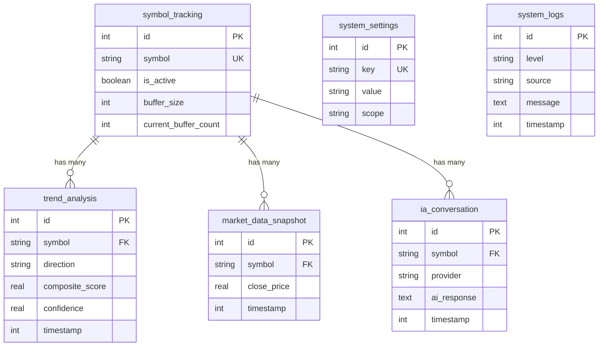

# Database Schema

This folder contains SQL migration scripts for the SQLite database.

## Schema Files

| File | Table | Description |
|------|-------|-------------|
| `01_symbol_tracking.sql` | `symbol_tracking` | Tracked symbols and buffer status |
| `02_trend_analysis.sql` | `trend_analysis` | Calculated trend analysis results |
| `03_market_data_snapshot.sql` | `market_data_snapshot` | Historical market data |
| `04_system_settings.sql` | `system_settings` | Application configuration |
| `05_ia_conversation.sql` | `ia_conversation` | AI provider conversations |
| `06_system_logs.sql` | `system_logs` | Application logs |

## Execution Order

Scripts are executed in numerical order during database initialization.

## Schema Migration

The `DatabaseService` automatically runs these scripts on first startup.

### Version Control

Schema changes should:
1. Create a new migration file with incremented number
2. Include `IF NOT EXISTS` clauses
3. Add migration tracking in `schema_migrations` table

## Usage

```typescript
// Automatic on service start
const dbService = new DatabaseService();
await dbService.initialize();
```

## Table Relationships



## Index Strategy

- **Primary Keys**: Auto-increment for all tables
- **Foreign Keys**: Indexed on `symbol` column
- **Timestamps**: Indexed for time-range queries
- **Composite Indexes**: Created for common query patterns

## Data Types

| SQLite Type | TypeScript Type | Usage |
|-------------|-----------------|-------|
| INTEGER | number | IDs, counters, booleans (0/1), timestamps |
| REAL | number | Prices, scores, percentages |
| TEXT | string | Symbols, directions, JSON |

## Constraints

- **CHECK**: Enum validation (direction, level, provider)
- **UNIQUE**: Prevent duplicates (symbol, settings key)
- **NOT NULL**: Required fields
- **DEFAULT**: Auto-timestamps, default values

## Triggers

- **update_*_timestamp**: Auto-update `updated_at` on row changes

## Performance Considerations

1. **Indexes**: Created on frequently queried columns
2. **Composite Indexes**: For multi-column queries
3. **Partial Indexes**: For filtered queries (errors only)
4. **Covering Indexes**: Include commonly selected columns

## Maintenance

### Vacuum

Run periodically to reclaim space:
```sql
VACUUM;
```

### Analyze

Update statistics for query optimizer:
```sql
ANALYZE;
```

### Cleanup Old Data

Example for logs (keep last 30 days):
```sql
DELETE FROM system_logs 
WHERE timestamp < strftime('%s', 'now', '-30 days');
```

## Backup Strategy

1. **Regular Backups**: Automated daily backups
2. **Before Migrations**: Backup before schema changes
3. **Export**: SQLite `.dump` for portability

```bash
sqlite3 trends.db ".backup 'backup.db'"
sqlite3 trends.db ".dump" > backup.sql
```
