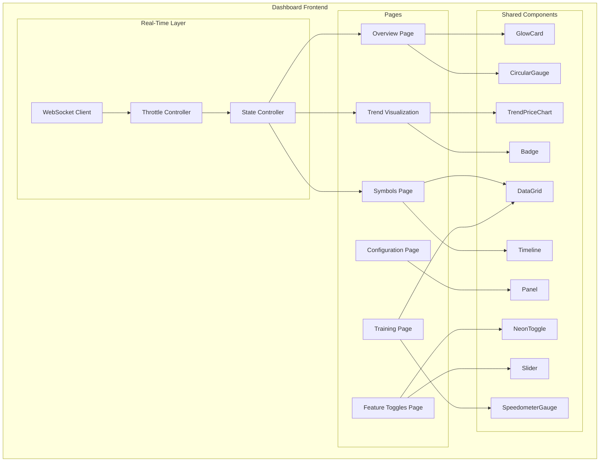
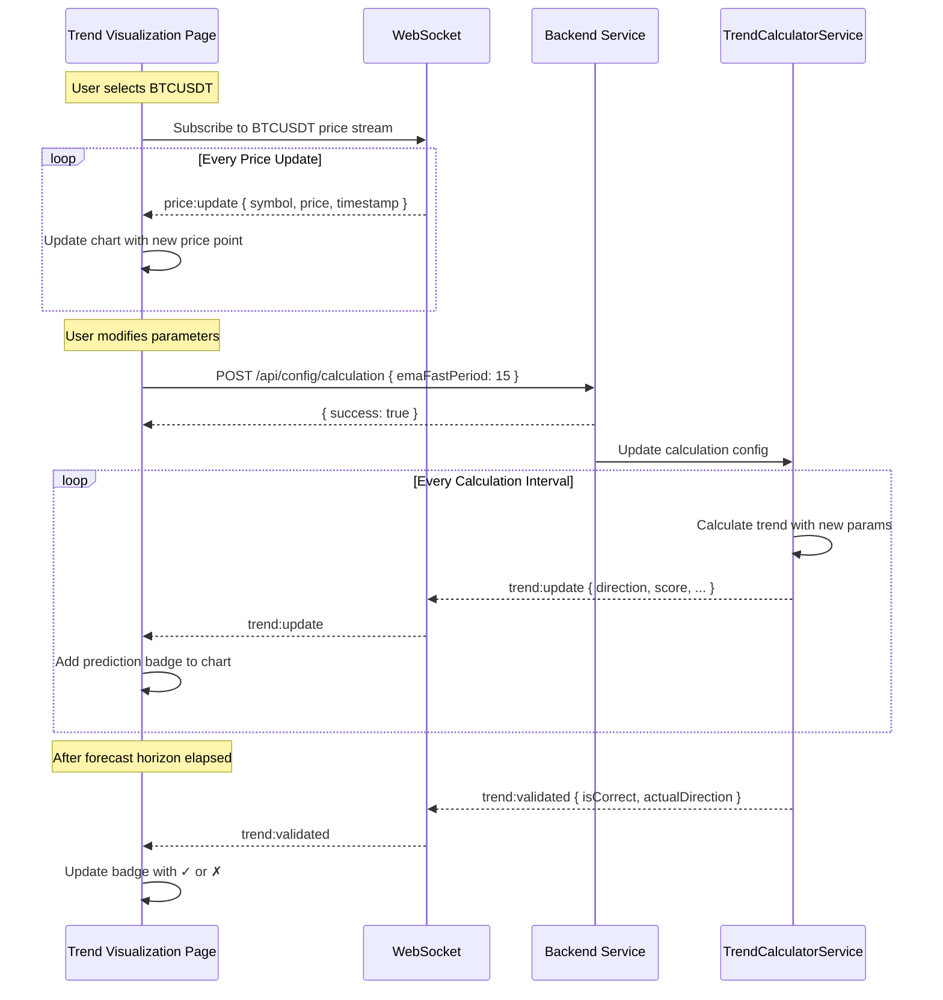

# Trend Analysis Microservice - Dashboard UI Design

> **Document Version**: 2.0  
> **Created**: 2025-12-26  
> **Last Updated**: 2025-12-26  
> **Parent Document**: [TrendsMicroService_Analysis.md](./TrendsMicroService_Analysis.md)  
> **Status**: REVIEWED

---

## Table of Contents

1. [Dashboard Overview](#1-dashboard-overview)
2. [UI Component Library Reference](#2-ui-component-library-reference)
3. [Dashboard Pages](#3-dashboard-pages)
4. [Component Specifications](#4-component-specifications)
5. [Settings Management UI](#5-settings-management-ui)
6. [Feature Toggle Settings UI](#6-feature-toggle-settings-ui) *(NEW)*
7. [Real-Time Monitoring](#7-real-time-monitoring)
8. [Training Mode Dashboard](#8-training-mode-dashboard)
9. [Micro-Interactions & Animations](#9-micro-interactions--animations) *(NEW)*
10. [Accessibility & Responsiveness](#10-accessibility--responsiveness) *(NEW)*
11. [Wireframes & Mockups](#11-wireframes--mockups)

---

## 1. Dashboard Overview

The Trend Analysis Microservice includes a dedicated **Dashboard UI** designed for professional trading environments, following institutional-grade UX principles.

### 1.1 Core Capabilities

| Capability | Description |
|------------|-------------|
| **Real-Time Trend Monitoring** | Live price charts with trend prediction overlays |
| **Symbol Tracking Management** | Add/remove symbols, view buffer progress |
| **AI Provider Configuration** | Configure Gemini/OpenAI, prompts, parameters |
| **Mathematical Feature Toggles** | Enable/disable analysis features dynamically |
| **Training Mode Evaluation** | Evaluate forecast accuracy in real-time |

### 1.2 UX Design Principles

> **Based on trading dashboard best practices research (2024)**

| Principle | Implementation |
|-----------|----------------|
| **Visual Hierarchy** | Critical metrics (direction, accuracy) at top-left; secondary data below |
| **Inverted Pyramid** | Most important information first, details on drill-down |
| **Card-Based Layout** | Each metric encapsulated in GlowCard for clear grouping |
| **4-5 Key Visualizations** | Primary dashboard limited to 4-5 KPIs to prevent overwhelm |
| **Actionable Insights** | Highlight insights, not just data; show "what to do next" |
| **Real-Time Feedback** | Sub-second updates with smooth animations, no flicker |
| **Interactive Drill-Down** | Click any card/gauge to see detailed breakdown |
| **Consistent Color Language** | Green=LONG, Red=SHORT, Yellow=WAIT throughout |

### 1.3 Dashboard Architecture



### 1.4 Page Overview

| Page | Purpose | Primary Components |
|------|---------|-------------------|
| **Overview** | System health KPIs, top symbols | GlowCard ×4, CircularGauge ×2, DataGrid |
| **Symbols** | Manage tracked symbols, buffer progress | DataGrid, ProgressBar, Panel |
| **Trend Visualization** | Real-time price + prediction overlay | TrendPriceChart, Badge, Slider |
| **Configuration** | AI & calculation settings | Panel, Input, Select, TextArea |
| **Feature Toggles** | Enable/disable mathematical features | NeonToggle, Slider, Panel, Badge |
| **Training** | Forecast accuracy evaluation | SpeedometerGauge, Timeline, DataGrid |

### 1.5 Technology Stack

| Layer | Technology | Notes |
|-------|------------|-------|
| **Framework** | React 18+ with TypeScript | Hooks, Suspense, Concurrent Mode |
| **State Management** | React Context + Hooks | `useReducer` for complex state |
| **Component Library** | `Ark.Alliance.React.Component.UI` | MVVM pattern, Zod validation |
| **Styling** | CSS Modules + CSS Variables | Themeable, dark-first design |
| **Real-Time** | Native WebSocket | Auto-reconnect, heartbeat |
| **Charts** | TrendPriceChart (SVG) | Custom component extending TestChart |

---

## 2. UI Component Library Reference

The dashboard leverages the `Ark.Alliance.React.Component.UI` library. Below are the relevant components:

### 2.1 Available Component Categories

| Category | Components | Dashboard Usage |
|----------|------------|-----------------|
| **Cards** | `GlowCard` | Symbol status cards, metric displays |
| **Gauges** | `CircularGauge`, `DigitalGauge`, `SpeedometerGauge`, `SignalBarsGauge` | Confidence indicators, buffer progress |
| **Grids** | `DataGrid` | Symbol list, prediction history |
| **Panel** | `Panel` | Settings sections, collapsible areas |
| **TimeLines** | `Timeline`, `TestTimeline` | Event history, prediction timeline |
| **Charts** | `TestChart` | Price charts, trend visualization |
| **Buttons** | Various | Actions, navigation |
| **Input** | Various (35+ components) | Configuration forms |
| **Modal** | Modal components | Detail views, confirmations |
| **ProgressBar** | Progress components | Buffer fill, training progress |
| **Toggles** | Toggle components | Feature switches |

### 2.2 Component Model Structure

All components follow MVVM pattern:

```
ComponentName/
├── ComponentName.model.ts      # Data models, interfaces
├── ComponentName.viewmodel.ts  # Business logic, state
├── ComponentName.tsx           # React component
├── ComponentName.styles.css    # Styling
└── index.ts                    # Exports
```

### 2.3 Key Component Interfaces

#### GlowCard (Cards/GlowCard)
```typescript
interface GlowCardProps {
    title?: string;
    subtitle?: string;
    glowColor?: string;
    className?: string;
    children: React.ReactNode;
}
```

#### CircularGauge (Gauges/CircularGauge)
```typescript
interface GaugeProps {
    value: number;              // 0-100
    min?: number;
    max?: number;
    label?: string;
    unit?: string;
    colorStops?: ColorStop[];   // Gradient colors
    size?: 'sm' | 'md' | 'lg';
}
```

#### DataGrid (Grids/DataGrid)
```typescript
interface DataGridProps<T> {
    data: T[];
    columns: ColumnDefinition[];
    onRowClick?: (row: T) => void;
    sortable?: boolean;
    filterable?: boolean;
    pagination?: PaginationConfig;
}
```

#### Panel (Panel)
```typescript
interface PanelProps {
    title: string;
    collapsible?: boolean;
    defaultCollapsed?: boolean;
    actions?: React.ReactNode;
    children: React.ReactNode;
}
```

---

## 3. Dashboard Pages

### 3.1 Overview Page

**Purpose**: Real-time summary of all tracked symbols and system health

**Components Used**:
- `GlowCard` × 4: Key metrics (Active Symbols, AI Status, Training Status, Predictions/min)
- `CircularGauge` × 2: Overall accuracy, confidence average
- `DataGrid`: Top 10 symbols by activity
- `Timeline`: Recent events

**Layout**:
```
┌─────────────────────────────────────────────────────────────┐
│  HEADER: Trend Analysis Dashboard                           │
├─────────────────────────────────────────────────────────────┤
│  ┌───────────┐ ┌───────────┐ ┌───────────┐ ┌───────────┐   │
│  │ Active    │ │ AI        │ │ Training  │ │ Pred/min  │   │
│  │ Symbols   │ │ Status    │ │ Status    │ │ Rate      │   │
│  │  [12]     │ │ [Online]  │ │ [Running] │ │ [45/min]  │   │
│  └───────────┘ └───────────┘ └───────────┘ └───────────┘   │
├─────────────────────────────────────────────────────────────┤
│  ┌─────────────────────────┐  ┌─────────────────────────┐   │
│  │    ACCURACY GAUGE       │  │    CONFIDENCE GAUGE     │   │
│  │    ┌─────────┐          │  │    ┌─────────┐          │   │
│  │    │  78.5%  │          │  │    │  0.72   │          │   │
│  │    └─────────┘          │  │    └─────────┘          │   │
│  └─────────────────────────┘  └─────────────────────────┘   │
├─────────────────────────────────────────────────────────────┤
│  TOP SYMBOLS BY ACTIVITY                                    │
│  ┌───────────────────────────────────────────────────────┐  │
│  │ Symbol  │ Direction │ Score  │ Confidence │ Updated   │  │
│  │ BTCUSDT │ LONG      │ +0.65  │ 82%        │ 2s ago    │  │
│  │ ETHUSDT │ SHORT     │ -0.42  │ 71%        │ 3s ago    │  │
│  │ ...     │ ...       │ ...    │ ...        │ ...       │  │
│  └───────────────────────────────────────────────────────┘  │
├─────────────────────────────────────────────────────────────┤
│  RECENT EVENTS (Timeline)                                   │
│  ○ Direction change: BTCUSDT LONG → SHORT                   │
│  ○ Training session started: Session #42                    │
│  ○ AI analysis completed: ETHUSDT (confidence: 85%)         │
└─────────────────────────────────────────────────────────────┘
```

### 3.2 Symbols Page

**Purpose**: Manage tracked symbols, view individual trend analysis

**Components Used**:
- `DataGrid`: All tracked symbols with status
- `Panel`: Symbol details (expandable)
- `ProgressBar`: Buffer fill progress
- `GlowCard`: Selected symbol details
- `Timeline`: Symbol price/trend history

**Features**:
- Add/Remove symbols for tracking
- View buffer fill progress
- Toggle AI analysis per symbol
- View historical trends

### 3.3 Configuration Page

**Purpose**: Manage all system settings

**Sections**:

| Section | Settings |
|---------|----------|
| **AI Provider** | Provider selection, API key, Model, Temperature, Max tokens |
| **AI Prompts** | System prompt, User template, Expected schema, Strategy context |
| **Calculation** | Buffer size, Min data points, EMA periods, Thresholds |
| **Binance WS** | Reconnection settings, Heartbeat interval |
| **Training** | Enable/disable, Evaluation interval, Forecast horizon |

### 3.4 Training Page

**Purpose**: Monitor training sessions and forecast accuracy

**Components Used**:
- `DataGrid`: Training sessions list
- `CircularGauge`: Accuracy metrics
- `Timeline`: Prediction history with validation
- `ProgressBar`: Session progress

### 3.5 Trend Visualization Page (NEW)

**Purpose**: Real-time price chart with trend calculation overlay, showing forecast vs reality

**Key Features**:
- Real-time price evolution chart with configurable precision
- Trend prediction badges plotted on the chart at calculation time
- Visual comparison of forecast direction vs actual price movement
- Symbol selection dropdown for switching between tracked symbols
- Live parameter modification with immediate effect on next calculations

#### 3.5.1 Page Layout

```
┌─────────────────────────────────────────────────────────────────────────────┐
│  TREND VISUALIZATION                                          [BTCUSDT ▼]  │
├─────────────────────────────────────────────────────────────────────────────┤
│  ┌─────────────────────────────────────────────────────────────────────────┐│
│  │                     REAL-TIME PRICE CHART                               ││
│  │  Price                                                                  ││
│  │  ▲                                                                      ││
│  │  │        ●LONG                      ●SHORT                             ││
│  │  │       ╱ ╲                        ╱╲                                  ││
│  │  │  ────╱   ╲──────────────────────╱  ╲───────────────▶ Time           ││
│  │  │     ↑     ╲         ╱╲        ╱    ╲  ╱                              ││
│  │  │  Prediction ──────╱  ╲──────╱      ╲╱                                ││
│  │  │  Badge      (price continues, showing forecast correctness)          ││
│  │  │                                                                      ││
│  │  └───────────────────────────────────────────────────────────────────────││
│  │  ◆ = Prediction Badge   ─── = Price Line   Shaded = Forecast Period    ││
│  └─────────────────────────────────────────────────────────────────────────┘│
├────────────────────────────────┬────────────────────────────────────────────┤
│  CURRENT STATUS                │  LIVE CALCULATION PARAMETERS              │
│  ┌───────────────────────────┐ │  ┌────────────────────────────────────────┐│
│  │ Symbol:     BTCUSDT       │ │  │ Buffer Size:      [100] ═══○═══════   ││
│  │ Price:      $94,521.45    │ │  │ Min Data Points:  [50]  ═══○═══════   ││
│  │ Direction:  [LONG ▲]      │ │  │ EMA Fast Period:  [10]  ══○════════   ││
│  │ Score:      +0.72         │ │  │ EMA Slow Period:  [30]  ════○══════   ││
│  │ Confidence: 85%           │ │  │ R² Threshold:     [0.3] ═══○═══════   ││
│  │ Updated:    2s ago        │ │  │ Composite Thresh: [0.3] ═══○═══════   ││
│  │ Buffer:     ████████░░ 82%│ │  │ Direction Ratio:  [0.4] ════○══════   ││
│  └───────────────────────────┘ │  │                                        ││
│                                │  │ Precision: [1s ▼] [1m] [15m]           ││
│  RECENT PREDICTIONS            │  │                                        ││
│  ┌───────────────────────────┐ │  │ [Apply Changes]        [Reset to Def] ││
│  │ 18:15:32 LONG  0.82 ✓     │ │  └────────────────────────────────────────┘│
│  │ 18:14:01 LONG  0.71 ✓     │ │                                            │
│  │ 18:12:45 SHORT 0.68 ✗     │ │  AI ANALYSIS (optional)                   │
│  │ 18:11:30 LONG  0.85 ⋯     │ │  ┌────────────────────────────────────────┐│
│  └───────────────────────────┘ │  │ Provider:    Gemini                    ││
│                                │  │ Model:       gemini-3-flash-preview    ││
│                                │  │ Temperature: 0.7                       ││
│                                │  │ Last Call:   18:15:32 (3s ago)         ││
│                                │  │ [Trigger AI Analysis]                  ││
│                                │  └────────────────────────────────────────┘│
└────────────────────────────────┴────────────────────────────────────────────┘
```

#### 3.5.2 Chart Component Specification

```typescript
interface TrendVisualizationChartProps {
    /** Selected symbol */
    symbol: string;
    
    /** Time precision for data points */
    precision: '1s' | '1m' | '15m';
    
    /** Maximum data points to display */
    maxDataPoints: number;          // default: 100
    
    /** Price time series data */
    priceData: PricePoint[];
    
    /** Trend calculations to overlay */
    trendPredictions: TrendPredictionOverlay[];
    
    /** Show forecast horizon shading */
    showForecastHorizon: boolean;
    
    /** Forecast horizon in milliseconds */
    forecastHorizonMs: number;      // default: 60000
    
    /** Callbacks */
    onPredictionClick?: (prediction: TrendPredictionOverlay) => void;
}

interface PricePoint {
    timestamp: number;              // Unix timestamp
    price: number;
    volume?: number;
}

interface TrendPredictionOverlay {
    id: string;
    timestamp: number;              // When prediction was made
    priceAtPrediction: number;
    direction: 'LONG' | 'SHORT' | 'WAIT';
    compositeScore: number;         // -1 to +1
    confidence: number;             // 0 to 1
    
    // Validation (filled after forecast horizon)
    isValidated: boolean;
    priceAtValidation?: number;
    actualDirection?: 'LONG' | 'SHORT' | 'WAIT';
    isCorrect?: boolean;
}
```

#### 3.5.3 Prediction Badge Component

```typescript
interface PredictionBadgeProps {
    direction: 'LONG' | 'SHORT' | 'WAIT';
    score: number;
    confidence: number;
    isValidated: boolean;
    isCorrect?: boolean;
    onClick?: () => void;
}

// Badge rendering:
// ● GREEN circle with ▲ arrow for LONG
// ● RED circle with ▼ arrow for SHORT  
// ● YELLOW circle with ◆ for WAIT

// Validation indicator:
// ✓ Green check = Correct prediction
// ✗ Red X = Wrong prediction
// ⋯ Gray dots = Pending validation
```

#### 3.5.4 Symbol Selector Component

```typescript
interface SymbolSelectorProps {
    /** Currently selected symbol */
    selectedSymbol: string;
    
    /** Available tracked symbols */
    availableSymbols: SymbolInfo[];
    
    /** On symbol change callback */
    onSymbolChange: (symbol: string) => void;
    
    /** Show buffer status in dropdown */
    showBufferStatus?: boolean;
}

interface SymbolInfo {
    symbol: string;
    isTracking: boolean;
    bufferPercent: number;
    lastDirection?: TrendDirection;
    lastUpdate?: Date;
}
```

#### 3.5.5 Live Parameters Panel

```typescript
interface LiveParametersPanelProps {
    /** Current calculation parameters */
    parameters: TrendCalculationParams;
    
    /** On parameter change - triggers next calculation with new params */
    onParametersChange: (params: Partial<TrendCalculationParams>) => void;
    
    /** Reset to defaults */
    onReset: () => void;
    
    /** Validation function */
    validateParams?: (params: TrendCalculationParams) => ValidationResult;
}

interface TrendCalculationParams {
    bufferSize: number;             // 10-500, default: 100
    minDataPoints: number;          // 5-100, default: 50
    emaFastPeriod: number;          // 2-50, default: 10
    emaSlowPeriod: number;          // 10-100, default: 30
    oscillationRSquaredThreshold: number;  // 0.0-1.0, default: 0.3
    compositeScoreThreshold: number;       // 0.0-1.0, default: 0.3
    directionChangeRatioThreshold: number; // 0.0-1.0, default: 0.4
    precision: '1s' | '1m' | '15m';
}
```

#### 3.5.6 Real-Time Data Flow



#### 3.5.7 Chart Visualization Details

**Price Line**:
- Smooth line chart (Bezier curves)
- Color: `#3b82f6` (blue) for price
- Stroke width: 2px
- Area fill: gradient with 10% opacity

**Prediction Badges**:
- Positioned on price line at exact timestamp
- Size: 16x16px circle
- Hover: Expand to 24x24px with tooltip
- Click: Show full prediction details modal

**Forecast Horizon Shading**:
- Light background shading from badge to horizon end
- Color: Same as direction (green/red/yellow) with 5% opacity
- Shows the "prediction window" visually

**Validation Markers**:
- After horizon: Small checkmark or X appears next to badge
- Line from prediction price to actual price at validation time
- Green line = correct, Red line = wrong

#### 3.5.8 WebSocket Events (Page-Specific)

| Event | Payload | Chart Update |
|-------|---------|--------------|
| `price:tick` | `{ symbol, price, ts }` | Append point to line |
| `trend:calculated` | `TrendResult` | Add prediction badge |
| `trend:validated` | `ValidationResult` | Update badge status |
| `buffer:progress` | `{ percent, isReady }` | Update status card |
| `config:updated` | `{ paramName, value }` | Reflect in params panel |

#### 3.5.9 Performance Considerations

```typescript
const CHART_CONFIG = {
    maxVisiblePoints: 100,      // Trim older points
    animationDuration: 200,     // Smooth transitions
    priceThrottle: 100,         // Max 10 updates/sec
    badgeAnimationDelay: 300,   // Stagger badge appearance
    rerenderDebounce: 50,       // Batch multiple updates
};
```

#### 3.5.10 Chart Component Analysis & Extension

The `Ark.Alliance.React.Component.UI` library contains existing chart components that can be extended:

##### Existing Components

| Component | Type | Suitability | Notes |
|-----------|------|-------------|-------|
| **TestChart** | SVG 2D | ✅ **EXCELLENT** | Price line, markers, thresholds - ideal base |
| **Chart3D** | WebGL 3D | ❌ Not suitable | 3D visualization, overkill for this use case |

##### TestChart Current Capabilities

```typescript
// From TestChart.model.ts - Already supports:
interface PricePoint {
    index: number;
    price: number;
    timestamp?: number;    // ✅ Already has timestamp support
}

interface StepMarker {
    stepIndex: number;
    label?: string;
    type: 'click' | 'inversion' | 'entry' | 'exit' | 'info';
    status: 'pending' | 'passed' | 'failed';
    pnl?: number;
}

interface ThresholdLine {
    label: string;
    value: number;
    type: 'click' | 'inversion' | 'entry' | 'target';
    color?: string;
}
```

##### Required Extension: TrendPriceChart

Create a new component `Charts/TrendPriceChart` extending `TestChart`:

```typescript
// TrendPriceChart/TrendPriceChart.model.ts
import { z } from 'zod';
import { PricePointSchema } from '../TestChart/TestChart.model';

/**
 * Extended price point with real-time timestamp
 */
export const RealTimePricePointSchema = PricePointSchema.extend({
    timestamp: z.number(),              // Required for real-time
    volume: z.number().optional(),
});

/**
 * Trend prediction overlay on chart
 */
export const TrendPredictionSchema = z.object({
    id: z.string(),
    timestamp: z.number(),
    priceAtPrediction: z.number(),
    direction: z.enum(['LONG', 'SHORT', 'WAIT']),
    compositeScore: z.number(),         // -1 to +1
    confidence: z.number(),             // 0 to 1
    
    // Validation state
    isValidated: z.boolean().default(false),
    priceAtValidation: z.number().optional(),
    actualDirection: z.enum(['LONG', 'SHORT', 'WAIT']).optional(),
    isCorrect: z.boolean().optional(),
    
    // Visual options
    showHorizon: z.boolean().default(true),
    horizonMs: z.number().default(60000),
});

/**
 * TrendPriceChart model extending TestChart
 */
export const TrendPriceChartModelSchema = z.object({
    // Symbol selection
    symbol: z.string(),
    precision: z.enum(['1s', '1m', '15m']).default('1s'),
    
    // Real-time data
    priceData: z.array(RealTimePricePointSchema).default([]),
    maxDataPoints: z.number().default(100),
    
    // Trend overlays
    predictions: z.array(TrendPredictionSchema).default([]),
    
    // Display options
    showGrid: z.boolean().default(true),
    showVolume: z.boolean().default(false),
    showForecastHorizon: z.boolean().default(true),
    animateNewPoints: z.boolean().default(true),
    
    // Axes
    autoScaleY: z.boolean().default(true),
    yAxisPadding: z.number().default(0.05),
    
    // Streaming
    isStreaming: z.boolean().default(false),
});

export type TrendPrediction = z.infer<typeof TrendPredictionSchema>;
export type RealTimePricePoint = z.infer<typeof RealTimePricePointSchema>;
export type TrendPriceChartModel = z.infer<typeof TrendPriceChartModelSchema>;
```

##### TrendPriceChart ViewModel Extensions

```typescript
// TrendPriceChart/TrendPriceChart.viewmodel.ts
export interface UseTrendPriceChartResult extends UseTestChartResult {
    // Real-time data management
    addPricePoint: (point: RealTimePricePoint) => void;
    clearPriceData: () => void;
    
    // Prediction overlays
    addPrediction: (prediction: TrendPrediction) => void;
    validatePrediction: (id: string, validation: PredictionValidation) => void;
    predictions: TrendPrediction[];
    
    // Computed
    predictionBadges: PredictionBadgeData[];  // For SVG rendering
    horizonAreas: HorizonAreaData[];          // For shaded regions
    
    // Streaming control
    startStreaming: () => void;
    stopStreaming: () => void;
}

interface PredictionBadgeData {
    id: string;
    x: number;                  // SVG x coordinate
    y: number;                  // SVG y coordinate
    direction: TrendDirection;
    isValidated: boolean;
    isCorrect?: boolean;
    tooltipData: TrendPrediction;
}

interface HorizonAreaData {
    predictionId: string;
    path: string;               // SVG path for shaded area
    color: string;              // Direction-based color
    opacity: number;            // 0.05 for subtle shading
}
```

##### New SVG Elements for TrendPriceChart

```tsx
// Additional SVG elements beyond TestChart:

{/* Forecast horizon shaded areas */}
{vm.horizonAreas.map(area => (
    <path
        key={`horizon-${area.predictionId}`}
        className="ark-trend-chart__horizon"
        d={area.path}
        fill={area.color}
        fillOpacity={area.opacity}
    />
))}

{/* Prediction badges */}
{vm.predictionBadges.map(badge => (
    <g
        key={badge.id}
        className={`ark-trend-chart__badge ark-trend-chart__badge--${badge.direction.toLowerCase()}`}
        transform={`translate(${badge.x}, ${badge.y})`}
        onClick={() => props.onPredictionClick?.(badge.tooltipData)}
    >
        <circle r={8} className="ark-trend-chart__badge-circle" />
        {badge.direction === 'LONG' && <path d="M0,-4 L3,2 L-3,2 Z" />}
        {badge.direction === 'SHORT' && <path d="M0,4 L3,-2 L-3,-2 Z" />}
        {badge.direction === 'WAIT' && <rect x={-2} y={-2} width={4} height={4} />}
        
        {/* Validation indicator */}
        {badge.isValidated && (
            <text 
                x={12} y={4} 
                className={`ark-trend-chart__validation ${badge.isCorrect ? 'correct' : 'wrong'}`}
            >
                {badge.isCorrect ? '✓' : '✗'}
            </text>
        )}
    </g>
))}

{/* Validation lines (from prediction to validation) */}
{vm.predictions.filter(p => p.isValidated).map(p => (
    <line
        key={`val-line-${p.id}`}
        className={`ark-trend-chart__validation-line ${p.isCorrect ? 'correct' : 'wrong'}`}
        x1={vm.toSvgPoint(p.timestamp, p.priceAtPrediction).x}
        y1={vm.toSvgPoint(p.timestamp, p.priceAtPrediction).y}
        x2={vm.toSvgPoint(p.timestamp + p.horizonMs, p.priceAtValidation!).x}
        y2={vm.toSvgPoint(p.timestamp + p.horizonMs, p.priceAtValidation!).y}
    />
))}
```

##### CSS Classes (TrendPriceChart.styles.css)

```css
/* Badge colors by direction */
.ark-trend-chart__badge--long .ark-trend-chart__badge-circle {
    fill: #22c55e;  /* Green */
}
.ark-trend-chart__badge--short .ark-trend-chart__badge-circle {
    fill: #ef4444;  /* Red */
}
.ark-trend-chart__badge--wait .ark-trend-chart__badge-circle {
    fill: #eab308;  /* Yellow */
}

/* Validation indicators */
.ark-trend-chart__validation.correct { fill: #22c55e; }
.ark-trend-chart__validation.wrong { fill: #ef4444; }

/* Horizon shading */
.ark-trend-chart__horizon {
    pointer-events: none;
}

/* Validation lines */
.ark-trend-chart__validation-line {
    stroke-width: 1;
    stroke-dasharray: 4 2;
}
.ark-trend-chart__validation-line.correct { stroke: #22c55e; }
.ark-trend-chart__validation-line.wrong { stroke: #ef4444; }
```

##### Implementation Priority

| Item | Priority | Effort | Dependency |
|------|----------|--------|------------|
| `TrendPriceChart.model.ts` | P0 | Low | None |
| `TrendPriceChart.viewmodel.ts` | P0 | Medium | model.ts |
| `TrendPriceChart.tsx` | P0 | Medium | viewmodel.ts |
| `TrendPriceChart.styles.css` | P0 | Low | component |
| Real-time streaming integration | P1 | Medium | viewmodel |
| Tooltip on badge hover | P2 | Low | component |

---

## 4. Component Specifications

### 4.1 TrendDirectionBadge

Custom component for displaying trend direction with color coding:

```typescript
interface TrendDirectionBadgeProps {
    direction: 'LONG' | 'SHORT' | 'WAIT';
    score?: number;          // -1 to +1
    animated?: boolean;      // Pulse animation on change
}

// Colors:
// LONG  → Green (#22c55e)
// SHORT → Red (#ef4444)
// WAIT  → Yellow (#eab308)
```

### 4.2 ConfidenceGauge

Specialized gauge for AI confidence display:

```typescript
interface ConfidenceGaugeProps {
    confidence: number;       // 0.0 to 1.0
    provider?: string;        // 'Gemini', 'OpenAI'
    lastUpdate?: Date;
}

// Color gradient:
// 0.0 - 0.4 → Red (low confidence)
// 0.4 - 0.7 → Yellow (medium)
// 0.7 - 1.0 → Green (high confidence)
```

### 4.3 BufferProgressCard

Shows data collection progress for a symbol:

```typescript
interface BufferProgressCardProps {
    symbol: string;
    currentPoints: number;
    requiredPoints: number;
    bufferSize: number;
    isReady: boolean;
    lastDirection?: TrendDirection;
}
```

### 4.4 PredictionTimelineItem

Timeline item for prediction visualization:

```typescript
interface PredictionTimelineItemProps {
    prediction: {
        predictedAt: Date;
        direction: TrendDirection;
        confidence: number;
        priceAtPrediction: number;
    };
    validation?: {
        evaluatedAt: Date;
        actualDirection: TrendDirection;
        priceAtEvaluation: number;
        isCorrect: boolean;
    };
}
```

---

## 5. Settings Management UI

### 5.1 Settings Page Layout

```
┌─────────────────────────────────────────────────────────────┐
│  CONFIGURATION                                              │
├─────────────────────────────────────────────────────────────┤
│  ┌─── AI Provider ─────────────────────────────────────┐    │
│  │ Provider:    [Gemini ▼]                             │    │
│  │ API Key:     [••••••••••••••] [Test]               │    │
│  │ Model:       [gemini-2.0-flash        ]            │    │
│  │ Temperature: [0.7] ═══════○══════                   │    │
│  │ Max Tokens:  [1024]                                │    │
│  └──────────────────────────────────────────────────────┘    │
│                                                              │
│  ┌─── AI Prompts ───────────────────────────────────────┐   │
│  │ [System Prompt]  [User Template]  [Response Schema]  │   │
│  │ ┌───────────────────────────────────────────────────┐│   │
│  │ │ {                                                 ││   │
│  │ │   "role": "High-Frequency Trading Quant...",     ││   │
│  │ │   "expertise": [...],                            ││   │
│  │ │   ...                                            ││   │
│  │ │ }                                                 ││   │
│  │ └───────────────────────────────────────────────────┘│   │
│  │                                      [Save Prompts]  │   │
│  └──────────────────────────────────────────────────────┘   │
│                                                              │
│  ┌─── Calculation Parameters ───────────────────────────┐   │
│  │ Buffer Size:           [100]                         │   │
│  │ Min Data Points:       [50]                          │   │
│  │ EMA Fast Period:       [10]                          │   │
│  │ EMA Slow Period:       [30]                          │   │
│  │ R² Threshold:          [0.3] ═══○═══════             │   │
│  │ Composite Score Thresh:[0.3] ═══○═══════             │   │
│  │ Direction Change Ratio:[0.4] ════○══════             │   │
│  └──────────────────────────────────────────────────────┘   │
│                                                              │
│  ┌─── WebSocket Settings ───────────────────────────────┐   │
│  │ Environment:           [MAINNET ▼]                   │   │
│  │ Reconnection Enabled:  [✓]                           │   │
│  │ Reconnection Delay:    [1000] ms                     │   │
│  │ Max Delay:             [30000] ms                    │   │
│  │ Heartbeat Interval:    [30000] ms                    │   │
│  └──────────────────────────────────────────────────────┘   │
│                                                              │
│                                    [Reset Defaults] [Save]   │
└─────────────────────────────────────────────────────────────┘
```

### 5.2 Settings Form Components

| Setting Type | Component | Validation |
|--------------|-----------|------------|
| Text/String | `Input.TextField` | Required, max length |
| Number | `Input.NumericInput` | Min/max bounds |
| Range (0-1) | `Input.Slider` | Step: 0.01 |
| Selection | `Input.Select` | Enum options |
| Boolean | `Toggles.NeonToggle` | - |
| JSON | `Input.TextArea` | JSON.parse validation |
| Secret | `Input.PasswordField` | Masked display |

---

## 6. Feature Toggle Settings UI

> **📌 Configuration Model Reference**: [TrendsMicroService_Analysis.md - Section 16](./TrendsMicroService_Analysis.md#16-mathematical-feature-toggle-configuration)

This section defines the UI for managing **Mathematical Feature Toggles** - enabling/disabling features like Stationarity Testing, Hurst Exponent, GARCH Volatility, and Regime Detection dynamically.

### 6.1 Feature Toggle Page Layout

```
┌─────────────────────────────────────────────────────────────────────────────┐
│  FEATURE TOGGLE CONFIGURATION                        [Preset: STANDARD ▼]  │
├─────────────────────────────────────────────────────────────────────────────┤
│                                                                             │
│  ┌─── CRITICAL FEATURES ─────────────────────────────────────────────────┐  │
│  │                                                                       │  │
│  │  Stationarity Testing                                    [═══○═══]   │  │
│  │  ┌─────────────────────────────────────────────────────────────────┐ │  │
│  │  │ Method:         [QUICK_CHECK ▼]                                 │ │  │
│  │  │ Auto-Transform: [✓]  Transform to log-returns if non-stationary│ │  │
│  │  │ Variance Ratio: [0.5] ═══○═══════  to [2.0] ═════════○════     │ │  │
│  │  └─────────────────────────────────────────────────────────────────┘ │  │
│  │                                                                       │  │
│  │  Autocorrelation Testing                                 [═══○═══]   │  │
│  │  ┌─────────────────────────────────────────────────────────────────┐ │  │
│  │  │ Method:         [DURBIN_WATSON ▼]                               │ │  │
│  │  │ Adjust R²:      [✓]  Automatically correct R² for autocorr     │ │  │
│  │  │ DW Range:       [1.5] ══○════════  to [2.5] ════════○═══       │ │  │
│  │  └─────────────────────────────────────────────────────────────────┘ │  │
│  │                                                                       │  │
│  └───────────────────────────────────────────────────────────────────────┘  │
│                                                                             │
│  ┌─── HIGH PRIORITY FEATURES ────────────────────────────────────────────┐  │
│  │                                                                       │  │
│  │  Hurst Exponent                                          [═══○═══]   │  │
│  │  ┌─────────────────────────────────────────────────────────────────┐ │  │
│  │  │ Mean-Reverting: [0.45] ═══○═══════   H below = oscillating     │ │  │
│  │  │ Trending:       [0.55] ═════○═════   H above = trending        │ │  │
│  │  │ Min Data Pts:   [100]                                           │ │  │
│  │  │ [✓] Use for Oscillation Detection                              │ │  │
│  │  └─────────────────────────────────────────────────────────────────┘ │  │
│  │                                                                       │  │
│  │  Comprehensive Metrics                                   [═══○═══]   │  │
│  │  ┌─────────────────────────────────────────────────────────────────┐ │  │
│  │  │ [✓] Sharpe Ratio    [✓] Sortino     [✓] Max Drawdown          │ │  │
│  │  │ [✓] Calmar Ratio    [✓] Profit Factor  [○] Value at Risk      │ │  │
│  │  │ Risk-Free Rate: [0.02] ══○════════                              │ │  │
│  │  │ Rolling Window: [252] days                                      │ │  │
│  │  └─────────────────────────────────────────────────────────────────┘ │  │
│  │                                                                       │  │
│  │  Walk-Forward Analysis                                   [═══○═══]   │  │
│  │  ┌─────────────────────────────────────────────────────────────────┐ │  │
│  │  │ In-Sample Ratio: [0.7] ════════○══                              │ │  │
│  │  │ Periods:         [5]                                            │ │  │
│  │  └─────────────────────────────────────────────────────────────────┘ │  │
│  │                                                                       │  │
│  └───────────────────────────────────────────────────────────────────────┘  │
│                                                                             │
│  ┌─── OPTIONAL ADVANCED FEATURES ────────────────────────────────────────┐  │
│  │                                                                       │  │
│  │  GARCH Volatility                            [○         ] DISABLED   │  │
│  │  ───────────────────────────────────────────────────────────────────  │  │
│  │  Enable for: Dynamic thresholds based on volatility regime           │  │
│  │                                                                       │  │
│  │  Regime Detection                            [○         ] DISABLED   │  │
│  │  ───────────────────────────────────────────────────────────────────  │  │
│  │  Enable for: Auto-adjust strategy parameters per market regime       │  │
│  │                                                                       │  │
│  │  Monte Carlo Simulation                      [○         ] DISABLED   │  │
│  │  ───────────────────────────────────────────────────────────────────  │  │
│  │  Enable for: Robustness validation of strategy parameters            │  │
│  │                                                                       │  │
│  └───────────────────────────────────────────────────────────────────────┘  │
│                                                                             │
│  ┌─── CONFIGURATION ACTIONS ─────────────────────────────────────────────┐  │
│  │                                                                       │  │
│  │  [Apply Changes]    [Reset to Defaults]    [View Audit Log]          │  │
│  │                                                                       │  │
│  │  Last Updated: 2025-12-26 18:15:32 by admin                          │  │
│  │                                                                       │  │
│  └───────────────────────────────────────────────────────────────────────┘  │
└─────────────────────────────────────────────────────────────────────────────┘
```

### 6.2 Component Mapping

| UI Element | Component | Props |
|------------|-----------|-------|
| Feature Toggle | `Toggles.NeonToggle` | `checked`, `onChange`, `label` |
| Method Selector | `Input.Select` | `options`, `value`, `onChange` |
| Numeric Parameter | `Input.Slider` | `min`, `max`, `step`, `value` |
| Checkbox | `Input.Checkbox` or Inline Toggle | `checked`, `onChange` |
| Feature Card | `Panel` | `title`, `collapsible: true` |
| Preset Selector | `Input.Select` | Preset options with icons |
| Action Buttons | `Button` | `variant: 'primary'`, `'secondary'` |
| Status Badge | `Label.Badge` | `variant: 'success'`/`'warning'`/`'danger'` |

### 6.3 Feature Toggle Card Component

```typescript
interface FeatureToggleCardProps {
    /** Feature identifier */
    featureKey: keyof MathematicalFeaturesConfig;
    
    /** Display title */
    title: string;
    
    /** Description text */
    description: string;
    
    /** Priority level for styling */
    priority: 'CRITICAL' | 'HIGH' | 'OPTIONAL';
    
    /** Current enabled state */
    enabled: boolean;
    
    /** Feature-specific parameters */
    params: Record<string, number | string | boolean>;
    
    /** Parameter definitions for rendering */
    paramDefinitions: ParamDefinition[];
    
    /** Callbacks */
    onToggle: (enabled: boolean) => void;
    onParamChange: (paramKey: string, value: any) => void;
}

interface ParamDefinition {
    key: string;
    label: string;
    type: 'number' | 'select' | 'checkbox' | 'range';
    min?: number;
    max?: number;
    step?: number;
    options?: { value: string; label: string }[];
    description?: string;
}
```

### 6.4 Preset Quick Selection

```typescript
const PRESET_OPTIONS = [
    { 
        value: 'MINIMAL', 
        label: '⚡ Minimal', 
        description: 'Fastest performance, essential features only' 
    },
    { 
        value: 'STANDARD', 
        label: '⭐ Standard', 
        description: 'Recommended for production trading' 
    },
    { 
        value: 'ADVANCED', 
        label: '🔬 Advanced', 
        description: 'All features enabled for research' 
    },
    { 
        value: 'INSTITUTIONAL', 
        label: '🏛️ Institutional', 
        description: 'Full audit trail, compliance-focused' 
    },
];
```

### 6.5 Audit Log Panel

```
┌─── CONFIGURATION AUDIT LOG ──────────────────────────────────────────────┐
│  [Filter: All ▼]  [Date Range: Last 7 days ▼]              [Export CSV] │
├──────────────────────────────────────────────────────────────────────────┤
│  ┌────────────────────────────────────────────────────────────────────┐  │
│  │  2025-12-26 18:15:32  │  hurstExponent.enabled           │  API   │  │
│  │  Changed: false → true                                            │  │
│  │  User: admin  │  Reason: "Testing Hurst for BTC oscillation"      │  │
│  ├────────────────────────────────────────────────────────────────────┤  │
│  │  2025-12-26 17:45:00  │  garchVolatility.params.alpha    │  API   │  │
│  │  Changed: 0.10 → 0.15                                             │  │
│  │  User: admin  │  Reason: "Adjusting for high vol market"          │  │
│  ├────────────────────────────────────────────────────────────────────┤  │
│  │  2025-12-26 16:00:00  │  PRESET_APPLIED                   │ SYSTEM│  │
│  │  Applied: STANDARD                                                │  │
│  │  User: system  │  Reason: "Initial configuration"                 │  │
│  └────────────────────────────────────────────────────────────────────┘  │
└──────────────────────────────────────────────────────────────────────────┘
```

### 6.6 Validation & Feedback

| Scenario | User Feedback |
|----------|---------------|
| Invalid parameter range | Red border on input, inline error message |
| Conflicting configuration | Warning badge + tooltip explaining conflict |
| Change requires restart | Yellow notification banner |
| Successful save | Green toast notification with "Changes applied" |
| Preset applied | Info toast with list of affected features |

---

## 7. Real-Time Monitoring

### 7.1 WebSocket Events

The dashboard subscribes to the following WebSocket events:

| Event | Payload | UI Update |
|-------|---------|-----------|
| `trend:update` | `TrendResult` | Symbol card, gauge, grid row |
| `trend:directionChange` | `DirectionChangeEvent` | Timeline item, notification |
| `symbol:bufferProgress` | `BufferStatus` | Progress bar |
| `training:predictionMade` | `Prediction` | Timeline, counter |
| `training:predictionValidated` | `ValidationResult` | Accuracy gauge, grid |
| `system:health` | `HealthStatus` | Status indicator |
| `ai:analysisComplete` | `AIResult` | AI status card |

### 7.2 Real-Time State Management

```typescript
interface DashboardState {
    // Connection
    wsConnected: boolean;
    lastHeartbeat: Date | null;
    
    // Symbols
    trackedSymbols: Map<string, SymbolState>;
    selectedSymbol: string | null;
    
    // Training
    activeSession: TrainingSession | null;
    predictions: Prediction[];
    
    // Metrics
    recentEvents: DashboardEvent[];
    accuracyMetrics: AccuracyMetrics;
}
```

### 7.3 Update Throttling

To prevent UI thrashing with high-frequency updates:

```typescript
const THROTTLE_CONFIG = {
    trendUpdate: 100,         // Max 10 updates/sec per symbol
    bufferProgress: 500,      // Max 2 updates/sec
    gridRefresh: 1000,        // Max 1 grid refresh/sec
    gaugeAnimation: 200,      // Smooth gauge transitions
};
```

---

## 8. Training Mode Dashboard

### 8.1 Training Session View

```
┌─────────────────────────────────────────────────────────────┐
│  TRAINING SESSION #42                        [Stop Session] │
├─────────────────────────────────────────────────────────────┤
│  Status: RUNNING          Duration: 45:32 / 60:00          │
│  ┌─────────────────────────────────────────────────────┐    │
│  │ ═══════════════════════════════════════○═══         │    │
│  │                                    75.8%             │    │
│  └─────────────────────────────────────────────────────┘    │
├─────────────────────────────────────────────────────────────┤
│  ┌───────────┐ ┌───────────┐ ┌───────────┐ ┌───────────┐   │
│  │ Predictions│ │ Correct   │ │ Accuracy  │ │ MAPE      │   │
│  │   [156]   │ │   [122]   │ │  [78.2%]  │ │  [1.24%]  │   │
│  └───────────┘ └───────────┘ └───────────┘ └───────────┘   │
├─────────────────────────────────────────────────────────────┤
│  ACCURACY BY DIRECTION                                      │
│  LONG:  ████████████████░░░░ 82% (67/82)                   │
│  SHORT: ██████████████░░░░░░ 74% (55/74)                   │
│  WAIT:  N/A                                                 │
├─────────────────────────────────────────────────────────────┤
│  PREDICTION TIMELINE                                        │
│  ┌─────────────────────────────────────────────────────┐    │
│  │ 18:15:32 │ BTCUSDT │ LONG  │ 0.82 │ ✓ Correct      │    │
│  │ 18:15:01 │ ETHUSDT │ SHORT │ 0.71 │ ✗ Wrong        │    │
│  │ 18:14:30 │ BTCUSDT │ LONG  │ 0.85 │ ⋯ Pending      │    │
│  │ ...                                                  │    │
│  └─────────────────────────────────────────────────────┘    │
└─────────────────────────────────────────────────────────────┘
```

### 8.2 Accuracy Visualization

Use `SpeedometerGauge` for direction accuracy:

```typescript
<SpeedometerGauge
    value={accuracyMetrics.directionAccuracy * 100}
    min={0}
    max={100}
    zones={[
        { from: 0, to: 50, color: '#ef4444' },   // Red: Poor
        { from: 50, to: 70, color: '#eab308' },  // Yellow: Fair
        { from: 70, to: 85, color: '#22c55e' },  // Green: Good
        { from: 85, to: 100, color: '#10b981' }, // Emerald: Excellent
    ]}
    label="Direction Accuracy"
    unit="%"
/>
```

---

## 9. Micro-Interactions & Animations

> **Based on research**: Micro-animations improve user engagement and provide immediate feedback.

### 9.1 Animation Guidelines

| Component | Animation | Duration | Easing |
|-----------|-----------|----------|--------|
| **Gauge Value Change** | Smooth needle rotation | 300ms | ease-out |
| **Trend Direction Badge** | Fade in + scale | 200ms | ease-in-out |
| **GlowCard Hover** | Glow intensity increase | 150ms | ease |
| **Panel Collapse** | Height transition | 300ms | ease-out |
| **DataGrid Row Sort** | Cards shuffle animation | 250ms | ease-in-out |
| **Price Chart Update** | Smooth line extension | 100ms | linear |
| **Toggle Switch** | Slide + color transition | 200ms | ease |
| **Toast Notification** | Slide in from right | 300ms | ease-out |

### 9.2 Transition Specifications

```css
/* CSS Custom Properties for consistent animations */
:root {
    --ark-transition-fast: 100ms;
    --ark-transition-normal: 200ms;
    --ark-transition-slow: 300ms;
    --ark-easing-smooth: cubic-bezier(0.4, 0, 0.2, 1);
    --ark-easing-bounce: cubic-bezier(0.34, 1.56, 0.64, 1);
}

/* Gauge needle animation */
.ark-gauge__needle {
    transition: transform var(--ark-transition-slow) var(--ark-easing-smooth);
}

/* GlowCard hover glow */
.ark-glow-card {
    transition: box-shadow var(--ark-transition-normal) ease;
}

/* Panel collapse */
.ark-panel__body {
    transition: max-height var(--ark-transition-slow) ease-out;
    overflow: hidden;
}

/* Trend badge appearance */
@keyframes badge-appear {
    from { opacity: 0; transform: scale(0.8); }
    to { opacity: 1; transform: scale(1); }
}

.ark-trend-chart__badge {
    animation: badge-appear var(--ark-transition-normal) var(--ark-easing-bounce);
}
```

### 9.3 Reduced Motion Support

```css
/* Respect user preference for reduced motion */
@media (prefers-reduced-motion: reduce) {
    *, *::before, *::after {
        animation-duration: 0.01ms !important;
        transition-duration: 0.01ms !important;
    }
}
```

---

## 10. Accessibility & Responsiveness

> **Based on research**: Professional dashboards require WCAG 2.1 AA compliance and mobile-first design.

### 10.1 Accessibility Requirements

| Requirement | Implementation | Component Impact |
|-------------|----------------|------------------|
| **Keyboard Navigation** | Tab order, Enter/Space activation | All interactive elements |
| **Screen Reader** | ARIA labels, live regions | Gauges, Charts, Alerts |
| **Color Contrast** | 4.5:1 ratio minimum | All text, badges |
| **Focus Indicators** | Visible focus rings | Buttons, inputs, cards |
| **Color-Blind Safety** | Patterns + colors for direction | LONG/SHORT badges |

### 10.2 ARIA Implementation

```typescript
// GlowCard with accessibility
<div
    role={onClick ? 'button' : undefined}
    tabIndex={onClick ? 0 : undefined}
    aria-label={title}
    aria-pressed={isActive}
    onKeyDown={(e) => e.key === 'Enter' && onClick?.()}
>

// Gauge with live updates
<div
    role="meter"
    aria-label="Accuracy"
    aria-valuenow={78.5}
    aria-valuemin={0}
    aria-valuemax={100}
    aria-live="polite"
>

// Real-time updates announcement
<div aria-live="polite" aria-atomic="true" className="sr-only">
    Direction changed to LONG with 85% confidence
</div>
```

### 10.3 Responsive Breakpoints

| Breakpoint | Width | Layout |
|------------|-------|--------|
| **Mobile** | < 640px | Single column, stacked cards |
| **Tablet** | 640-1024px | 2-column grid |
| **Desktop** | 1024-1440px | 3-column grid |
| **Wide** | > 1440px | 4-column grid, side panel |

### 10.4 Mobile Optimizations

| Optimization | Implementation |
|--------------|----------------|
| **Touch Targets** | Minimum 44×44px for all interactive elements |
| **Swipe Gestures** | Swipe left/right to change symbols |
| **Bottom Navigation** | Fixed bottom nav on mobile for quick page access |
| **Simplified Charts** | Reduced data points, larger badges on mobile |
| **Collapsible Sections** | Auto-collapse secondary sections on mobile |

### 10.5 Theme Support

```typescript
// All components support isDark prop
<GlowCard isDark={true} ... />
<CircularGauge isDark={true} ... />
<DataGrid isDark={true} ... />

// CSS Variables for theming
:root {
    --ark-bg-primary: #1f2937;
    --ark-bg-secondary: #374151;
    --ark-text-primary: #f9fafb;
    --ark-text-secondary: #9ca3af;
}

[data-theme="light"] {
    --ark-bg-primary: #ffffff;
    --ark-bg-secondary: #f3f4f6;
    --ark-text-primary: #111827;
    --ark-text-secondary: #6b7280;
}
```

---

## 11. Wireframes & Mockups

### 11.1 Color Palette

| Purpose | Color | Hex |
|---------|-------|-----|
| LONG / Bullish | Green | `#22c55e` |
| SHORT / Bearish | Red | `#ef4444` |
| WAIT / Neutral | Yellow | `#eab308` |
| Primary Accent | Blue | `#3b82f6` |
| Background Dark | Charcoal | `#1f2937` |
| Card Background | Dark Gray | `#374151` |
| Text Primary | White | `#f9fafb` |
| Text Secondary | Gray | `#9ca3af` |

### 11.2 Typography

| Element | Font | Size | Weight |
|---------|------|------|--------|
| Page Title | Inter | 24px | 600 |
| Section Header | Inter | 18px | 500 |
| Card Title | Inter | 14px | 500 |
| Body Text | Inter | 14px | 400 |
| Metric Value | Outfit | 32px | 700 |
| Small Label | Inter | 12px | 400 |

### 11.3 Responsive Breakpoints (Summary)

| Breakpoint | Width | Layout Changes |
|------------|-------|----------------|
| Mobile | < 640px | Single column, stacked cards |
| Tablet | 640-1024px | 2-column grid |
| Desktop | 1024-1440px | 3-column grid |
| Wide | > 1440px | 4-column grid, side panel |

---

## Document Control

| Version | Date | Author | Changes |
|---------|------|--------|---------|
| 1.0 | 2025-12-26 | Architecture Team | Initial draft |
| 1.1 | 2025-12-26 | Architecture Team | Added Section 3.5 Trend Visualization Page with real-time chart, TrendPriceChart component spec |
| 2.0 | 2025-12-26 | Architecture Team | **Major Update**: Added UX design principles, Feature Toggle Settings UI (Section 6), Micro-Interactions (Section 9), Accessibility (Section 10). Enhanced component mappings to library. |

---

**Related Documents**:
- [TrendsMicroService_Analysis.md](./TrendsMicroService_Analysis.md) - Main architecture document
- [TrendsMicroService_Analysis_Dashboard_LibrairyReactEnhancementBugFixPrerequisit.md](./TrendsMicroService_Analysis_Dashboard_LibrairyReactEnhancementBugFixPrerequisit.md) - Component library prerequisites
