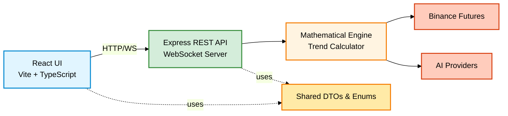

# Ark Alliance Trends Calculator

<div align="center">

[](https://github.com/M2H-Machine-to-Human-Race/Ark.Alliance.Trading.TrendsCalculator/actions)
[]()
[](https://www.typescriptlang.org/)
[](https://react.dev/)
[](https://nodejs.org/)
[](./LICENSE)

**Production-Ready Real-Time Cryptocurrency Trend Analysis Platform**

*M2H.Io Ark.Alliance Ecosystem* • *Version 1.0.0*

[Quick Start](#quick-start) • [Documentation](#documentation) • [Contributing](./CONTRIBUTING.md)

</div>

---

## What is This?

A **full-stack TypeScript platform** combining real-time market data streaming with advanced mathematical analysis (Hurst Exponent, GARCH, Linear Regression, EMA) and AI-powered decision support via multiple providers (Anthropic, OpenAI, Google Gemini).

**Use Cases:** Algorithmic trading • Market analysis • Quantitative research • Trading education

**Core Capabilities:**
- Real-time trend calculation with WebSocket streaming from Binance
- Mathematical indicators: Hurst Exponent, GARCH forecasting, Linear Regression, EMA crossovers
- AI-powered analysis with confidence scoring (Anthropic, OpenAI, Gemini)
- Walk-forward validation and backtesting capabilities
- MVVM architecture with ark-alliance-react-ui component library

---

## Architecture



**Layered Architecture:**
- **[Frontend](./Ark.Alliance.TrendsCalculator.Ui/README.md)**: React 19 with MVVM pattern
- **[Backend](./Ark.Alliance.TrendsCalculator.Backend/README.md)**: Node.js/Express with real-time WebSocket
- **[Share](./Ark.Alliance.TrendsCalculator.Share/README.md)**: TypeScript DTOs, enums, constants
- **[Tests](./Ark.Alliance.TrendsCalculator.Tests/README.md)**: Vitest with 148 test cases (98.6% passing)

---

## Quick Start

### Prerequisites
- Node.js >= 18.0.0
- npm >= 8.0.0
- (Optional) Binance account for live data
- (Optional) AI API key (Anthropic, OpenAI, or Gemini) for AI features

### Installation

```bash
# Clone and navigate
git clone https://github.com/M2H-Machine-to-Human-Race/Ark.Alliance.Trading.TrendsCalculator.git
cd Ark.Alliance.Trading.TrendsCalculator

# Install and build Share library (required first)
cd Ark.Alliance.TrendsCalculator.Share
npm install && npm run build

# Start Backend
cd ../Ark.Alliance.TrendsCalculator.Backend
npm install
cp .env.example .env  # Configure your environment
npm run dev           # Runs on port 3001

# Start Frontend (new terminal)
cd ../Ark.Alliance.TrendsCalculator.Ui
npm install
npm run dev           # Runs on port 5173
```

### Configuration

Edit `Backend/.env`:
```env
# Server
PORT=3001
NODE_ENV=development

# Binance (use testnet for development)
BINANCE_USE_TESTNET=true
BINANCE_API_KEY=your_key
BINANCE_SECRET_KEY=your_secret

# AI (optional)
# AI Provider (choose one)
AI_PROVIDER=gemini       # Options: anthropic, openai, gemini
GEMINI_API_KEY=your_gemini_key
# OPENAI_API_KEY=your_openai_key
# ANTHROPIC_API_KEY=your_anthropic_key

# Analysis
DEFAULT_BUFFER_SIZE=200
MIN_BUFFER_SIZE=50
```

### Access
- **Frontend**: http://localhost:5173
- **Backend API**: http://localhost:3001
- **API Docs**: See [Backend README](./Ark.Alliance.TrendsCalculator.Backend/README.md#api-endpoints)

---

## Documentation

| Document | Description |
|:---------|:------------|
| **[Backend API](./Ark.Alliance.TrendsCalculator.Backend/README.md)** | REST endpoints, WebSocket events, services, mathematical helpers |
| **[Frontend UI](./Ark.Alliance.TrendsCalculator.Ui/README.md)** | MVVM components, pages, contexts, real-time integration |
| **[Shared DTOs](./Ark.Alliance.TrendsCalculator.Share/README.md)** | TypeScript interfaces, enums, validation schemas, constants | 
| **[Tests](./Ark.Alliance.TrendsCalculator.Tests/README.md)** | Test architecture, scenarios, integration tests, coverage |
| **[Contributing](./CONTRIBUTING.md)** | Development setup, coding standards, PR process |

**Mathematical Indicators:**
- **Hurst Exponent**: Market persistence analysis (H < 0.5: mean-reverting, H > 0.5: trending)
- **GARCH**: Volatility forecasting with conditional heteroskedasticity
- **Linear Regression**: Trend slope calculation with R² confidence
- **EMA Crossover**: Short-term (50) vs long-term (200) trend signals

---

## Tech Stack

| Layer | Technologies |
|:------|:-------------|
| Frontend | React 19, TypeScript 5.6, Vite, Socket.IO Client, ark-alliance-react-ui |
| Backend | Node.js 18+, Express, TypeScript 5.6, Socket.IO Server, ark-alliance-trading-providers-lib |
| Shared | TypeScript, Zod validation |
| Testing | Vitest, 148 test cases, 98.6% pass rate |
| External | Binance Futures API, Multi-provider AI (Anthropic, OpenAI, Gemini) |

---

## Project Structure

```
Ark.Alliance.Trading.TrendsCalculator/
├── Ark.Alliance.TrendsCalculator.Backend/    # Node.js API + WebSocket
│   ├── src/
│   │   ├── api/                              # Controllers, routes, middleware
│   │   ├── services/                         # Business logic
│   │   ├── domain/                           # Mathematical algorithms
│   │   └── infrastructure/                   # External integrations
│   └── README.md                             # 📚 Backend Documentation
│
├── Ark.Alliance.TrendsCalculator.Share/      # Shared TypeScript DTOs
│   ├── src/
│   │   ├── dto/                              # Data Transfer Objects
│   │   ├── enums/                            # Enumerations
│   │   └── Constants.ts                      # Application constants
│   └── README.md                             # 📚 Share Documentation
│
├── Ark.Alliance.TrendsCalculator.Ui/         # React Frontend
│   ├── src/
│   │   ├── components/                       # MVVM UI Components
│   │   ├── pages/                            # Page components
│   │   ├── contexts/                         # React Contexts
│   │   └── services/                         # API clients
│   └── README.md                             # 📚 Frontend Documentation
│
├── Ark.Alliance.TrendsCalculator.Tests/      # Vitest Test Suite
│   ├── src/
│   │   ├── unit/                             # Unit tests
│   │   ├── integration/                      # Integration tests
│   │   └── indicators/                       # Indicator tests
│   └── README.md                             # 📚 Test Documentation
│
├── .github/workflows/                        # CI/CD pipelines
├── CONTRIBUTING.md                           # Contribution guidelines
└── README.md                                 # ⬅️ You are here
```

---

## Contributing

We welcome contributions! See [CONTRIBUTING.md](./CONTRIBUTING.md) for:
- Development setup and prerequisites
- Coding standards (MVVM, TypeScript, enums)
- Testing requirements and coverage
- Pull request process

**Quick Guidelines:**
- Follow MVVM pattern for frontend components
- Import all types from Share project
- Use enums instead of hardcoded strings
- Write JSDoc with `@author Armand Richelet-Kleinberg`
- Add tests for new features (maintain >95% coverage)

---

## License

MIT License - see [LICENSE](./LICENSE)

**Copyright © 2025-2026 M2H.Io Ark.Alliance**

---

## Author

**Armand Richelet-Kleinberg**  
M2H.Io Ark.Alliance Ecosystem

*Developed with assistance from [Claude Sonnet](https://www.anthropic.com/claude) (Anthropic AI)*

---

<div align="center">

**[⭐ Star on GitHub](https://github.com/M2H-Machine-to-Human-Race/Ark.Alliance.Trading.TrendsCalculator)** • **[🐛 Report Issues](https://github.com/M2H-Machine-to-Human-Race/Ark.Alliance.Trading.TrendsCalculator/issues)** • **[💬 Contributing](./CONTRIBUTING.md)**

</div>
