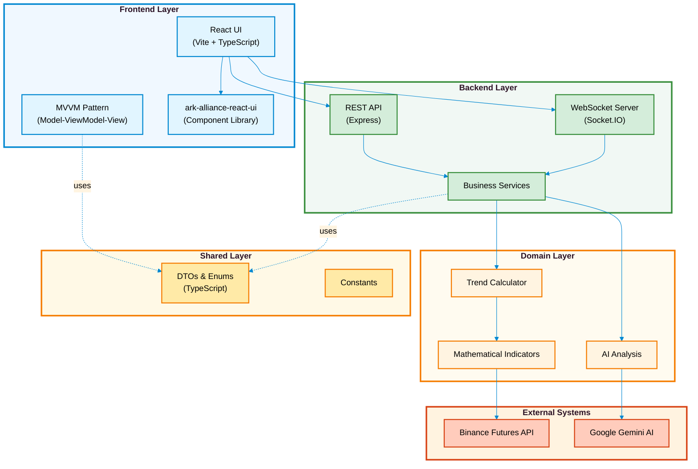
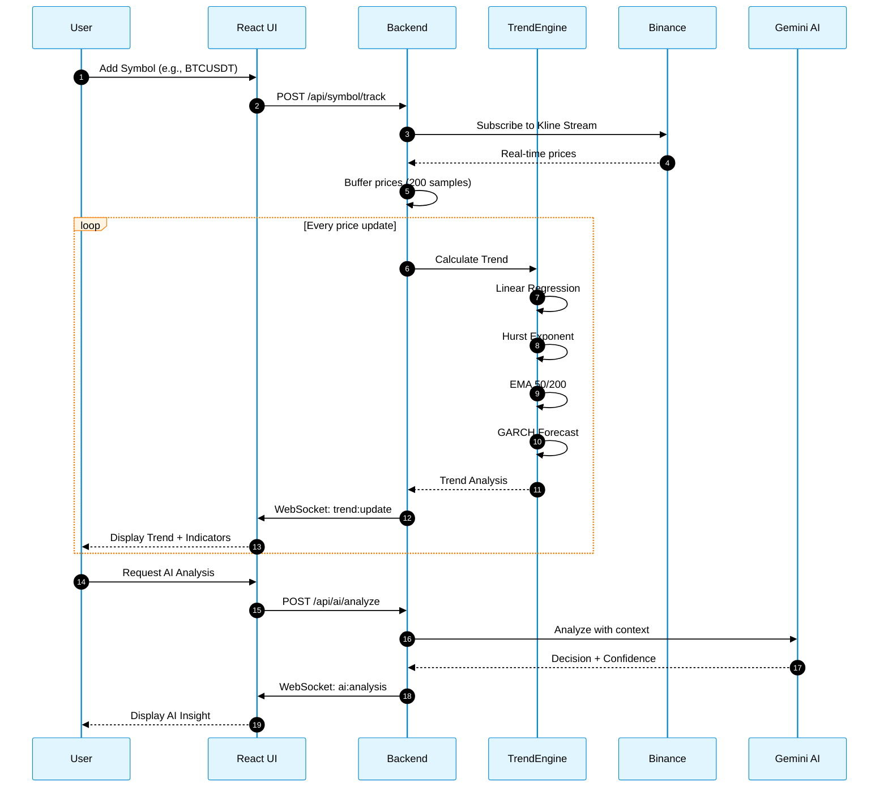

# <i class="fa fa-chart-line"></i> Ark Alliance Trends Calculator

<div align="center">

[](https://github.com/ArmandRicheletKleinberg/Ark.Alliance.Trading.TrendsCalculator/actions)
[]()
[](https://www.typescriptlang.org/)
[](https://react.dev/)
[](https://nodejs.org/)
[](./LICENSE)

**🚀 Production-Ready Real-Time Cryptocurrency Trend Analysis Platform**

*Organization*: M2H.Io Ark.Alliance Ecosystem  
*Version*: 1.0.0  
*Last Updated*: 2026-01-02

[Quick Start](#-quick-start) • [Backend Docs](./Ark.Alliance.TrendsCalculator.Backend/README.md) • [Frontend Docs](./Ark.Alliance.TrendsCalculator.Ui/README.md) • [Contributing](./CONTRIBUTING.md)

</div>

---

## <i class="fa fa-question-circle"></i> What is This?

A **production-ready full-stack application** for real-time cryptocurrency trend analysis with AI-powered decision support. Combines advanced mathematical indicators (Hurst Exponent, GARCH, Linear Regression, EMA) with Google Gemini AI to provide actionable trading insights.

**Perfect for:**
- <i class="fa fa-robot"></i> Algorithmic trading systems
- <i class="fa fa-chart-line"></i> Market analysis platforms
- <i class="fa fa-graduation-cap"></i> Quantitative finance research
- <i class="fa fa-briefcase"></i> Trading education tools

---

## <i class="fa fa-star"></i> Key Features

| Feature | Description |
|:--------|:------------|
| <i class="fa fa-chart-area"></i> **Real-Time Analysis** | Live trend calculation with WebSocket streaming from Binance |
| <i class="fa fa-brain"></i> **AI Integration** | Google Gemini-powered analysis with confidence scoring |
| <i class="fa fa-calculator"></i> **Mathematical Engine** | Hurst Exponent, GARCH forecasting, Linear Regression, EMA |
| <i class="fa fa-broadcast-tower"></i> **WebSocket Streaming** | Real-time price updates and trend recalculation |
| <i class="fa fa-mobile-alt"></i> **MVVM Architecture** | Clean frontend architecture with ark-alliance-react-ui |
| <i class="fa fa-graduation-cap"></i> **Training Mode** | Walk-forward validation and backtesting capabilities |
| <i class="fa fa-chart-line"></i> **Visual Analytics** | Interactive charts with trend overlays and indicators |
| <i class="fa fa-code"></i> **TypeScript-First** | Full type safety with shared DTOs across stack |
| <i class="fa fa-shield-alt"></i> **Production-Ready** | Error handling, logging, environment configuration |
| <i class="fa fa-globe"></i> **Testnet Support** | Binance testnet integration for safe development |

---

## <i class="fa fa-sitemap"></i> System Architecture



---

## <i class="fa fa-rocket"></i> Quick Start

### Prerequisites

- Node.js >= 18.0.0
- npm >= 8.0.0
- Binance account (optional, for live data)
- Google Gemini API key (optional, for AI features)

### Installation

```bash
# Clone the repository
git clone https://github.com/ArmandRicheletKleinberg/Ark.Alliance.Trading.TrendsCalculator.git
cd Ark.Alliance.Trading.TrendsCalculator

# Install and build Share (DTOs & Enums) first
cd Ark.Alliance.TrendsCalculator.Share
npm install
npm run build

# Install and start Backend
cd ../Ark.Alliance.TrendsCalculator.Backend
npm install
cp .env.example .env
# Edit .env with your configuration
npm run dev

# Install and start Frontend (in a new terminal)
cd ../Ark.Alliance.TrendsCalculator.Ui
npm install
npm run dev
```

### Configuration

Edit `Ark.Alliance.TrendsCalculator.Backend/.env`:

```env
# Server Configuration
PORT=3001
NODE_ENV=development

# Binance Configuration (use testnet for development)
BINANCE_API_KEY=your_binance_api_key
BINANCE_SECRET_KEY=your_binance_secret
BINANCE_USE_TESTNET=true

# Google Gemini AI (optional)
GEMINI_API_KEY=your_gemini_api_key

# Trend Calculation Settings
DEFAULT_BUFFER_SIZE=200
MIN_BUFFER_SIZE=50
```

### Access the Application

- **Frontend**: http://localhost:5173
- **Backend API**: http://localhost:3001
- **WebSocket**: ws://localhost:3001

---

## <i class="fa fa-cogs"></i> Tech Stack

### Frontend
- **Framework**: React 19.0 with Vite
- **Language**: TypeScript 5.6
- **UI Library**: ark-alliance-react-ui (custom MVVM components)
- **State Management**: React Context API
- **Real-Time**: Socket.IO Client
- **Styling**: CSS Modules
- **Build**: Vite with HMR

### Backend
- **Runtime**: Node.js 18+
- **Framework**: Express.js
- **Language**: TypeScript 5.6
- **Real-Time**: Socket.IO Server
- **External APIs**: Binance Futures, Google Gemini
- **Provider Library**: ark-alliance-trading-providers-lib

### Mathematical Engine
- **Indicators**:
  - Hurst Exponent (market persistence analysis)
  - GARCH (volatility forecasting)
  - Linear Regression (trend slope calculation)
  - EMA (Exponential Moving Averages)
  - Walk-Forward Validation

### Shared
- **DTOs**: Zod-validated TypeScript interfaces
- **Enums**: Centralized enumerations
- **Constants**: Application-wide constants

---

## <i class="fa fa-folder-tree"></i> Project Structure

```
Ark.Alliance.Trading.TrendsCalculator/
├── Ark.Alliance.TrendsCalculator.Backend/    # Node.js REST API + WebSocket
│   ├── src/
│   │   ├── application/services/             # Business logic services
│   │   ├── domain/services/                  # Mathematical algorithms
│   │   ├── infrastructure/                   # External integrations
│   │   └── presentation/api/                 # Controllers & routes
│   └── README.md                             # 📚 BACKEND DOCS
│
├── Ark.Alliance.TrendsCalculator.Share/      # Shared DTOs & Enums
│   ├── src/
│   │   ├── dto/                              # Data Transfer Objects
│   │   ├── enums/                            # Enumerations
│   │   └── Constants.ts                       # Application constants
│   └── README.md                             # 📚 SHARE DOCS
│
├── Ark.Alliance.TrendsCalculator.Ui/         # React Frontend
│   ├── src/
│   │   ├── components/                       # UI Components (MVVM)
│   │   ├── contexts/                         # React Contexts
│   │   ├── helpers/                          # Utility functions
│   │   ├── pages/                            # Page components (MVVM)
│   │   └── services/                         # API clients
│   └── README.md                             # 📚 FRONTEND DOCS
│
├── .github/workflows/                        # CI/CD pipelines
├── CONTRIBUTING.md                           # Contribution guidelines
├── LICENSE                                   # MIT License
└── README.md                                 # ⬅️ You are here
```

---

## <i class="fa fa-exchange-alt"></i> Trend Analysis Flow



---

## <i class="fa fa-graduation-cap"></i> Mathematical Indicators

### Hurst Exponent
Measures market **persistence** vs **mean-reversion**:
- **H < 0.5**: Mean-reverting (anti-persistent) → Range trading
- **H ≈ 0.5**: Random walk → Neutral
- **H > 0.5**: Trending (persistent) → Trend following

### GARCH Forecasting
Forecasts future **volatility** based on conditional heteroskedasticity:
- Predicts next-period variance
- Identifies volatility clustering
- Risk management insights

### Linear Regression
Calculates trend **slope** and **strength**:
- Slope: direction and steepness
- R²: trend reliability (0-1)
- Composite score: weighted indicator

### Exponential Moving Averages
- **EMA 50**: Short-term trend
- **EMA 200**: Long-term trend  
- **Crossover**: Bullish/Bearish signals

---

## <i class="fa fa-book-open"></i> Documentation

| Document | Description |
|:---------|:------------|
| **[<i class="fa fa-server"></i> Backend API](./Ark.Alliance.TrendsCalculator.Backend/README.md)** | REST endpoints, WebSocket events, services architecture |
| **[<i class="fa fa-desktop"></i> Frontend UI](./Ark.Alliance.TrendsCalculator.Ui/README.md)** | MVVM pattern, components, pages, state management |
| **[<i class="fa fa-share-alt"></i> Shared DTOs](./Ark.Alliance.TrendsCalculator.Share/README.md)** | Data structures, enums, validation schemas |
| **[<i class="fa fa-users"></i> Contributing](./CONTRIBUTING.md)** | Coding standards, PR process, development setup |
| **[<i class="fa fa-file-contract"></i> License](./LICENSE)** | MIT License details |

---

## <i class="fa fa-users"></i> Contributing

We welcome contributions! Please see [CONTRIBUTING.md](./CONTRIBUTING.md) for:
- Development setup
- Coding standards (MVVM, TypeScript, enums)
- Testing requirements
- Pull request process

### Quick Guidelines
- Follow **MVVM pattern** for frontend components
- Import all types from **Share project**
- Use **enums** instead of hardcoded strings
- Write **JSDoc** with `@author Armand Richelet-Kleinberg`
- Add **tests** for new features
- Keep PRs **focused and small**

---

## <i class="fa fa-pen"></i> Author

**Armand Richelet-Kleinberg**  
M2H.Io Ark.Alliance Ecosystem

*Developed with the assistance of [Claude Sonnet](https://www.anthropic.com/claude) (Anthropic AI)*

---

## <i class="fa fa-file-contract"></i> License

MIT License - see [LICENSE](./LICENSE) file for details

**Copyright © 2025-2026 M2H.Io Ark.Alliance**

---

<div align="center">

**Built with <i class="fa fa-heart"></i> for the quantitative trading community**

[<i class="fa fa-github"></i> GitHub](https://github.com/ArmandRicheletKleinberg/Ark.Alliance.Trading.TrendsCalculator) • [<i class="fa fa-bug"></i> Issues](https://github.com/ArmandRicheletKleinberg/Ark.Alliance.Trading.TrendsCalculator/issues) • [<i class="fa fa-users"></i> Contributing](./CONTRIBUTING.md)

</div>
